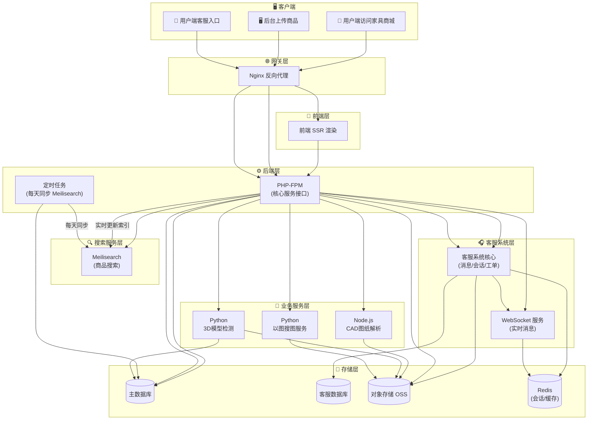

# abangmi · 帮米家具商城

> 基于 **Laravel 8 + 微擎 (WeEngine)** 的大型 SaaS 电商中台，以「插件化架构 + 多渠道支付 + 3D 商品可视化」为技术特色，覆盖 B2C 商城、分销裂变、社区营销、直播带货、门店 POS 等全链路电商场景。
>
> **在线演示**: <https://abangmi.com>

---

## 目录

- [项目简介](#项目简介)
- [核心特性](#核心特性)
- [技术栈](#技术栈)
- [系统架构](#系统架构)
- [目录结构](#目录结构)
- [核心功能模块](#核心功能模块)
- [插件体系](#插件体系)
- [支付体系](#支付体系)
- [异步任务与事件驱动](#异步任务与事件驱动)
- [数据与缓存](#数据与缓存)
- [路由体系](#路由体系)
- [快速开始](#快速开始)
- [部署](#部署)
- [文档索引](#文档索引)
- [版本](#版本)

---

## 项目简介

abangmi（帮米）是一个基于芸众商城（abangmishop）二次开发的家具电商平台，主营业务为**商用/家用家具商品在线展示与销售**，核心亮点包括：

- **家具商品 3D 可视化**：Three.js 在线预览 3D 模型、交互动画、CAD 图纸解析；
- **以图搜图**：接入 Python 图像检索服务，支持按图找同款家具；
- **多端触达**：Web 商城、小程序、公众号、微擎模块多入口并存；
- **SaaS 中台能力**：插件化扩展、多渠道支付、事件驱动、异步队列，可承载多种业务模式。

项目继承芸众商城的开源基因，并在此基础上针对家具垂直场景进行了深度定制与二次开发。

## 核心特性

| 能力维度 | 技术实现 | 规模 |
|----------|----------|------|
| **多端入口** | index / api / shop / module / site / processor / cron 等多入口 | 11+ 入口文件 |
| **插件体系** | 统一目录规范 + SPL 自动加载 + 生命周期管理 | **111 个插件** |
| **支付通道** | 统一 `PaymentServiceProvider` + 通道注册 | **55 个支付通道** |
| **事件驱动** | Laravel Event + Listener + Subscriber | 200+ 事件、50+ 监听器 |
| **异步队列** | Redis Queue + Workerman MQTT | 65+ Job 类 |
| **3D 可视化** | Three.js 0.171.0 + Tween.js 18.6.4 | 模型预览 / 交互动画 / CAD 解析 |
| **搜索引擎** | MeiliSearch / Elasticsearch 双引擎 | 商品全文检索 |
| **数据存储** | MySQL + MongoDB + Redis 混合架构 | 665 个迁移文件 |
| **以图搜图** | Python 图像检索服务 | 图片找同款 |

## 技术栈

### 后端

| 类别 | 技术 | 版本 | 用途 |
|------|------|------|------|
| 框架 | Laravel | 8.83.27 | Web 应用核心 |
| 运行时 | PHP | ^7.4 \| ^8.0 | 脚本语言 |
| 基座 | 微擎 (WeEngine) | - | 多模块/多租户宿主框架 |
| 数据库 | MySQL + MongoDB | - | 关系型 + 文档型混合存储 |
| 缓存/队列 | Redis (Predis) | 1.1.10 | 缓存、队列、限流、会话 |
| 搜索引擎 | MeiliSearch / Elasticsearch | ^1.16 | 商品全文检索（双引擎可切换） |
| 消息推送 | Workerman + MQTT | 4.1.15 / 1.6 | 长连接、实时消息 |
| 微信生态 | overtrue/laravel-wechat | 5.1.0 | 公众号/小程序/微信支付 |
| 支付 | yansongda/pay | 2.10.6 | 支付宝/微信等聚合支付 |
| 跨境支付 | PayPal REST API SDK | 1.13.0 | 国际支付 |
| 云存储 | 华为 OBS / 腾讯 COS | 3.23.11 / 2.6.13 | 文件存储/CDN |
| 云能力 | 腾讯云 live / tiia | 3.0.1159 | 直播 / 图像识别 |
| Excel | PhpSpreadsheet / Maatwebsite | 3.x | 导入导出 |
| 二维码 | Simple-QRCode / BaconQrCode | - | 二维码生成 |
| 短信 | 阿里云短信 (iscms/alisms) | 0.0.3 | 短信验证/通知 |

### 前端

| 类别 | 技术 | 版本 | 用途 |
|------|------|------|------|
| 构建工具 | Laravel Mix (Webpack) | 6.0.49 | 前端资源编译打包 |
| 3D 渲染 | Three.js | 0.171.0 | 3D 商品模型在线预览 |
| 动画库 | Tween.js | 18.6.4 | 3D 模型交互动画 |

### 微擎框架集成

- 数据库配置从微擎 `data/config.php` 动态加载；
- 兼容 `api.php`、`shop.php`、`module.php` 等多入口路由；
- 以微擎模块规范组织扩展（插件/支付/任务）。

## 系统架构

### 架构全景



### 请求链路

```
客户端
  → Nginx 反向代理
    → 多入口分发 (index.php / api.php / shop.php / module.php / cron.php ...)
      → Laravel 引导 (app/laravel.php → 自定义 Application → Kernel)
        → 中间件链 (全局 / 路由组 / 路由级)
          → 路由层 (9 个路由文件)
            → 控制器层 (backend / frontend / platform / outside / business)
              → 服务层 (app/common/services · app/frontend/modules)
                → 仓储层 (Repositories)
                  → 基础设施层 (Infrastructure)
                    → 数据层 (MySQL / MongoDB / Redis / MeiliSearch)
```

### 分层架构

```
┌──────────────────────────┐
│  Routes / Middleware     │  ← HTTP 请求入口与鉴权
├──────────────────────────┤
│  Controllers             │  ← API 控制器层 (Request/Response)
├──────────────────────────┤
│  Services                │  ← 业务逻辑层
├──────────────────────────┤
│  Repositories            │  ← 数据访问抽象接口
├──────────────────────────┤
│  Infrastructure          │  ← 具体数据源实现 (DB/API/Cache)
├──────────────────────────┤
│  Models / Entities       │  ← 数据模型定义
└──────────────────────────┘
```

### Service Provider 体系

| Provider | 职责 |
|----------|------|
| `ShopProvider` | 商城管理核心（绑定 18 个 Manager） |
| `YunShopServiceProvider` | 芸众业务注册 |
| `PluginServiceProvider` | 插件加载与生命周期 |
| `PaymentServiceProvider` | 支付通道注册 |
| `ExportServiceProvider` | 数据导出服务 |
| `CronServiceProvider` | 计划任务管理 |
| `ProjectServiceProvider` | 3D Project 模块注册 |
| `BusServiceProvider` | 命令总线（自定义扩展） |
| `DatabaseServiceProvider` | 数据库（自定义扩展） |
| `QueueServiceProvider` | 队列（自定义扩展） |
| `RedisServiceProvider` | Redis（自定义扩展） |

## 目录结构

```
abangmi/
├── app/                          # Laravel 应用核心
│   ├── backend/                  # 后台管理模块
│   ├── common/                   # 公共模块（跨端复用：服务/模型/事件/中间件）
│   ├── console/                  # Artisan 命令
│   ├── exports/                  # 数据导出
│   ├── framework/                # 框架扩展层（自定义 Application/DB/Queue/Redis）
│   ├── frontend/                 # 前端/API 模块（30+ 业务模块）
│   │   └── modules/              # cart/order/goods/member/project(3D)/refund...
│   ├── host/                     # 宿主模式入口
│   ├── http/                     # HTTP 核心
│   ├── Jobs/                     # 异步任务（65+）
│   ├── Mail/                     # 邮件模板
│   ├── outside/                  # 外部接口
│   ├── payment/                  # 支付回调处理
│   ├── platform/                 # 平台管理
│   ├── process/                  # 业务流程
│   ├── worker/                   # Worker 进程
│   ├── helpers.php               # 全局辅助函数
│   ├── yunshop.php               # 芸众引导文件
│   └── Kernel.php                # HTTP 内核
├── business/                     # 商家端业务逻辑
├── config/                       # 配置文件（37 个）
├── database/
│   ├── migrations/               # 迁移文件（665 个）
│   └── seeders/                  # 种子数据
├── docs/                         # 项目文档（架构/部署/Wiki）
├── payment/                      # 支付通道实现（55 个）
├── plugins/                      # 插件系统（111 个）
├── resources/                    # 视图/语言/前端资源
├── routes/                       # 路由定义（9 个文件）
├── storage/                      # 存储目录
├── vendor/                       # Composer 依赖
├── public/                       # 前端静态资源
├── composer.json                 # PHP 依赖定义
├── package.json                  # JS 依赖定义
└── artisan                       # Laravel CLI
```

## 核心功能模块

### 商品系统

- `GoodsBaseService`：商品数据加载、规格管理、3D 模型关联、品牌/分类；
- `GoodsSearchService`：基于 MeiliSearch 的全文检索、多维度筛选、搜索建议/历史；
- `GoodsRepository`：商品数据访问、CAD 解析、批量操作。

### 3D 可视化模块（Project）

| 功能 | 实现 |
|------|------|
| 3D 模型加载 | `getThreeModel()`，支持多格式 3D 模型在线展示 |
| 交互动画 | Tween.js 实现模型旋转、缩放、视角切换 |
| CAD 图纸解析 | DWG 上传后自动解析空间布局（Node.js 服务） |
| 下载限流 | IP + 商品 + 文件类型三级限流防护 |

### 订单系统

购物车 → 订单创建 → 支付处理 → 发货 → 收货 → 完成，支持退款/售后全流程：
`cart/`（购物车）、`order/`（订单生命周期）、`orderGoods/`、`refund/`、`dispatch/`（物流配送）。

### 会员系统

`member/`（基础信息/等级/积分）、`memberCart/`、`commission/`（分销佣金）、`income/`（收益）、`coin/`（虚拟币）、`withdraw/`（提现）。

### 营销系统

优惠券、拼团、抽奖、分享裂变、新人奖励、积分商城、签到等，多数以插件形式提供。

## 插件体系

`plugins/` 目录包含 **111 个插件**，遵循统一目录规范：

```
plugins/{plugin-name}/
├── src/           # 插件核心逻辑
├── views/         # 插件视图
├── assets/        # 插件静态资源
├── config/        # 插件配置
└── plugin.json    # 插件清单
```

| 分类 | 代表插件 |
|------|----------|
| 营销 | commission(分销)、coupon-qr、group-code(拼团)、lucky-draw(抽奖)、share-activity |
| 会员 | member-price、member-tags、new-member-prize、real-name-auth |
| 商品 | goods-assistant、goods-ranking、supplier、point-mall |
| 内容 | article、broadcast(直播)、picture-album、material-center |
| 企业微信 | work-wechat、work-wechat-platform、work-wechat-tag |
| 运营 | shop-statistics、customer-manage、customer-radar、sop-task |
| 交易支付 | pay-manage、service-fee、invoice、electronics-bill |
| 配送物流 | city-delivery、exhelper、package-delivery、express-company |
| 门店 POS | shop-pos、shop-assistant、shop-clerk、storeaggregate |
| 小程序/App | min-app、pc-terminal、appletslive |
| 第三方对接 | meituan-group-buy、tiktok-group-buy、jd-supply、leshua-pay |

## 支付体系

统一由 `PaymentServiceProvider` 注册管理，支持 **55 个支付通道**：

| 分类 | 通道 |
|------|------|
| 微信支付 | wechat、wechatscan、wxIntegrationPay、wxIntegrationSharePay、thirdPartyWechat |
| 支付宝 | alipay、zfbIntegrationPay、zfbIntegrationSharePay、alipayPeriodDeduct |
| 银联/云闪付 | eup、yunpay、yoppay、yoppro、yopsystem、yopmerchant |
| 聚合支付 | convergepay、convergequickpay、convergeseparate、storeaggregate |
| 跨境支付 | paypal、usdtpay |
| 余额/会员 | storebalance、membercard、silverPointPay、rechargeplatform |
| 分期/信用 | merchantLoanPay、huibeiPay、dragondeposit |
| 三方通道 | sandpay(杉德)、lakala(拉卡拉)、leshua(乐刷)、huanxun(环迅)、toutiaopay(头条) |

支付流程：订单 → 支付服务 → 选择通道 → 微信/支付宝/聚合/余额 → 回调 → 更新订单状态。

## 异步任务与事件驱动

- **异步队列**：65+ 个 Job 类运行在 Redis Queue 上，由 Workerman 常驻进程消费，Supervisor 守护；
- **事件驱动**：200+ 事件定义、50+ 监听器，核心业务变更通过事件解耦。

| 类别 | 代表 Job / 事件 |
|------|----------|
| 订单 | OrderCreated/Paid/Received/SentEventQueueJob、OrderBonusJob |
| 会员关系 | ChangeMemberRelationJob、ModifyRelationshipChainJob |
| 商品 | GoodsImageJob、GoodsSetPriceJob、BatchImportGoodsJob |
| 3D/文件 | UploadModelJob、ProductCadJob、GeneratePdfJob |
| 消息通知 | MessageJob、MiniMessageNoticeJob、MqttTopicMessageJob |
| 搜索同步 | UpdateMeiliSearch |

## 数据与缓存

| 连接 | 类型 | 用途 |
|------|------|------|
| `mysql` | MySQL（主库） | 核心业务数据 |
| `mysql_slave` | MySQL（从库） | 读写分离 |
| `kefu` | MySQL | 客服系统独立库 |
| `mongodb` | MongoDB | 文档型数据存储 |
| `redis` | Redis | 缓存、队列、会话、限流 |

**搜索引擎**：支持双引擎，通过 `.env` 配置切换 —— MeiliSearch（轻量、内置中文分词）或 Elasticsearch（通过 laravel-scout 集成）。

## 路由体系

9 个路由文件：

| 文件 | 用途 |
|------|------|
| `routes/admin.php` | 后台管理路由 |
| `routes/business.php` | 商家端路由 |
| `routes/shop.php` | 商城前端路由 |
| `routes/outside.php` | 外部接口路由 |
| `routes/api.php` | 公共 API 路由 |
| `routes/web.php` | Web 通用路由 |
| `routes/console.php` | Artisan 命令路由 |
| `routes/channels.php` | 广播频道路由 |
| `routes/boot.php` | 启动引导路由 |

多入口文件：`index.php`（主入口）、`api.php`（微擎 API）、`shop.php`（商城）、`module.php`（模块）、`site.php`（站点）、`processor.php`（消息处理）、`cron.php`（定时任务）、`install.php`/`uninstall.php`/`upgrade.php`（安装/卸载/升级）、`sql.php`。

## 快速开始

### 环境要求

| 组件 | 最低版本 |
|------|----------|
| PHP | 7.4+ |
| MySQL | 5.7+ |
| Redis | 6.0+ |
| MongoDB | 4.0+（可选） |
| Composer | 2.x |
| Node.js | 14+（前端构建） |
| MeiliSearch | 1.0+（可选，搜索引擎） |

### 安装步骤

```bash
# 1. 安装依赖
composer install
npm install

# 2. 配置环境
cp .env.example .env
# 编辑 .env 配置数据库、Redis 等

# 3. 生成应用密钥
php artisan key:generate

# 4. 运行数据库迁移
php artisan migrate

# 5. 启动队列 Worker
php artisan queue:work redis --queue=default

# 6. 编译前端资源
npm run dev    # 开发环境
npm run prod   # 生产环境
```

### 常用命令

```bash
# 清理缓存
php artisan cache:clear
php artisan config:clear
php artisan route:clear
php artisan view:clear

# 队列守护进程
bash daemon.sh

# 定时任务
php artisan cron:run

# 搜索引擎重建索引
php artisan meilisearch:reindex

# 数据库
php artisan migrate:status
php artisan db:seed
```

### 代码规范

- PSR-12 编码标准；
- 驼峰命名：类名大驼峰，方法/变量小驼峰；蛇形命名：配置、数据库字段；
- 分层原则：Controller → Service → Repository → Infrastructure；
- 核心业务变更必须触发事件，通过 Listener 解耦；
- 插件开发遵循 `plugins/` 统一目录规范。

## 部署

### 进程管理

| 进程 | 说明 | 启动方式 |
|------|------|----------|
| Queue Worker | 异步队列消费 | `php artisan queue:work redis --daemon`（Supervisor 守护） |
| Workerman | MQTT 长连接服务 | `php artisan workerman:start` |

### Supervisor 示例

```ini
[program:yunshop-queue]
process_name=%(program_name)s_%(process_num)02d
command=php /path/to/abangmi/artisan queue:work redis --queue=default --tries=3 --timeout=600
autostart=true
autorestart=true
numprocs=4
redirect_stderr=true
stdout_logfile=/path/to/logs/queue.log
```

### 常见问题

| 问题 | 排查方向 |
|------|----------|
| 搜索无结果 | 检查 MeiliSearch/ES 服务状态，执行 reindex 重建索引 |
| 3D 模型加载慢 | 检查 CDN 配置，确认 OBS/COS 存储桶状态 |
| 下载限流异常 | 清理 Redis keys `dl_limit_*`、`dl_blacklist:*` |
| 队列堆积 | 检查 Redis 内存，增加 Worker 进程数 |
| 支付回调失败 | 检查回调 URL 可达性，查看 `storage/logs/` |
| 数据库连接失败 | 确认微擎 `data/config.php` 配置同步 |

## 文档索引

| 文档 | 说明 |
|------|------|
| `docs/repo_wiki.md` | 项目百科：概述、技术栈、模块、开发指南（入门必读） |
| `docs/architecture_design.md` | 技术架构设计：请求链路、分层、Provider、插件/支付/事件/队列详解 |
| `docs/deployment_and_config.md` | 部署运维：环境、Nginx、Supervisor、故障排查（**含敏感信息，注意权限**） |
| `docs/project_module_handover.md` | Project 3D 模块专项交接文档 |
| `docs/整体系统架构图.mermaid` | 系统架构 Mermaid 源文件（可编辑） |
| `docs/整个系统架构图.png` | 系统架构静态预览图 |
| `docs/database_document.html` | 数据库 ER 图可视化（交互式） |

## 版本

| 组件 | 版本 |
|------|------|
| 主版本 | 2.3.359 |
| 后台 | 2.1.874 |
| 前端 | 2.2.988 |
| 商家端 | 1.1.113 |

---


