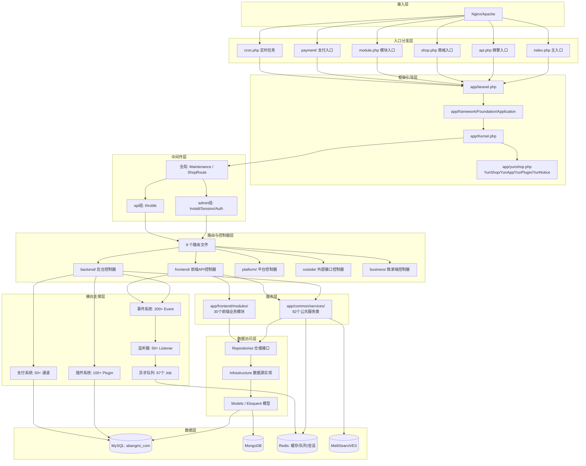
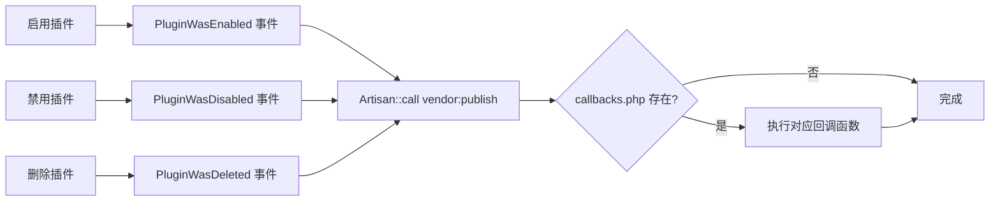
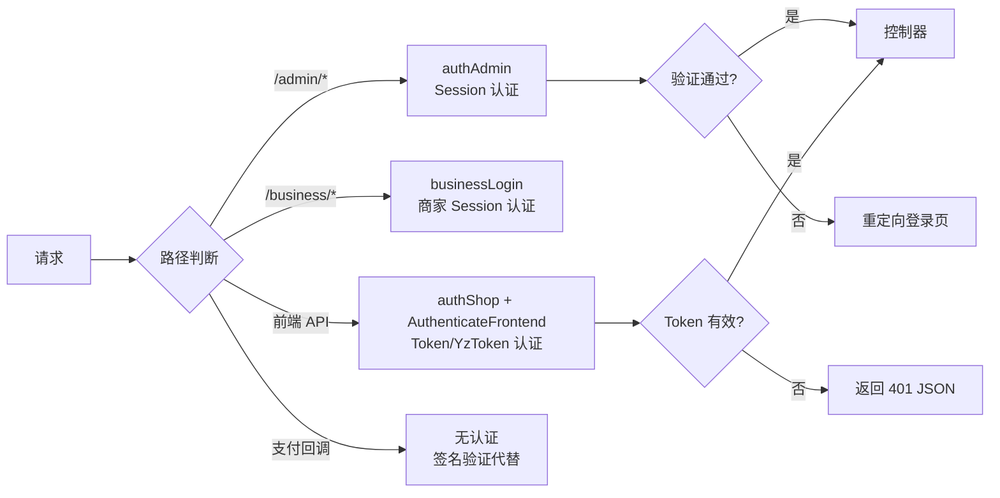

# 芸众商城 (abangmishop) — 架构设计文档

> **版本**: 主版本 2.3.359 | 后台 2.1.874 | 前端 2.2.988 | 商家端 1.1.113
> **框架**: Laravel 8.83.27 + 微擎 (WeEngine)
> **最后更新**: 2026-05-27
> **文档性质**: 技术架构设计，面向开发交接与新成员上手

---

## 1. 系统概述与架构全景

### 1.1 项目定位

芸众商城 (abangmishop) 是一个基于 **Laravel 8 + 微擎 (WeEngine)** 框架构建的大型 SaaS 电商中台系统，以 **"插件化架构 + 多渠道支付 + 3D可视化"** 为技术特色，提供覆盖 B2C 商城、分销裂变、社区营销、直播带货、门店 POS 等全链路电商解决方案。

### 1.2 核心能力矩阵

| 能力维度 | 技术实现 | 规模数据 |
|----------|----------|----------|
| **多端入口** | index.php / api.php / shop.php / admin.html / module.php / processor.php | 11 个入口文件 |
| **插件体系** | 统一目录规范 + SPL 自动加载 + 生命周期管理 | 100+ 插件 |
| **支付通道** | 统一 PaymentServiceProvider + 通道注册 | 50+ 支付通道 |
| **事件驱动** | Laravel Event + Listener + Subscriber | 200+ 事件定义, 50+ 监听器 |
| **异步队列** | Redis Queue + Workerman MQTT | 67 个 Job 类 |
| **3D 可视化** | Three.js 0.171.0 + Tween.js 18.6.4 | 模型预览/交互动画/CAD 解析 |
| **搜索引擎** | MeiliSearch / Elasticsearch 双引擎 | 商品全文检索 |
| **数据存储** | MySQL + MongoDB + Redis 混合架构 | 665 个迁移文件 |

### 1.3 架构全景图



---

## 2. 请求生命周期详解

### 2.1 完整调用链

```
HTTP 请求
  │
  ├─ Nginx/Apache 接收 → 根据 URL 分发到入口文件
  │
  ├─ [入口文件] index.php / api.php / shop.php 等
  │    ├─ 定义 LARAVEL_START 微秒时间戳
  │    ├─ require vendor/autoload.php (Composer 自动加载)
  │    └─ require bootstrap/app.php → 创建 Application 实例
  │
  ├─ [bootstrap/app.php]
  │    ├─ new app\framework\Foundation\Application() — 自定义 Application
  │    ├─ 绑定核心接口:
  │    │    ├─ Http\Kernel → app\Kernel
  │    │    ├─ Console\Kernel → app\console\Kernel
  │    │    ├─ ExceptionHandler → app\common\exceptions\Handler
  │    │    └─ Dispatcher → app\framework\Bus\Dispatcher
  │    └─ 注册自定义日志: TraceLog / DebugLog / ErrorLog
  │
  ├─ [app/laravel.php]
  │    ├─ $kernel = $app->make(HttpKernel::class)
  │    ├─ $request = app\framework\Http\Request::capture()
  │    ├─ $response = $kernel->handle($request)  ← 核心处理
  │    └─ $response->send()
  │
  ├─ [Kernel::handle() → sendRequestThroughRouter()]
  │    ├─ 全局中间件: CheckForMaintenanceMode → ShopRoute
  │    ├─ 路由组中间件 (根据路径前缀匹配):
  │    │    ├─ /admin → Install → Session → Auth → ...
  │    │    ├─ /api  → throttle:60,1
  │    │    └─ /     → web (空组)
  │    ├─ 路由匹配: RouteServiceProvider::map()
  │    ├─ 控制器中间件 (内部 Pipeline)
  │    └─ 控制器方法调用
  │
  ├─ [控制器 → 服务层 → 仓储层 → 数据源]
  │    └─ 业务流程处理 + 事件触发
  │
  └─ $kernel->terminate($request, $response)
       └─ 收尾工作: 日志写入、Session 存储、队列 Job 提交等
```

### 2.2 入口分发机制

项目运行模式由 `.env` 中的 `APP_Framework` 控制：

| 配置值 | 模式 | 说明 |
|--------|------|------|
| `platform` | 独立平台模式 | 使用 `.env` 配置，不依赖微擎 `data/config.php` |
| 其他值 | 微擎模式 | 从微擎 `data/config.php` 动态加载数据库配置 |

### 2.3 多入口文件与路由对应

| 入口文件 | 典型 URL | 路由文件 | 中间件组 |
|----------|----------|----------|----------|
| `index.php` | `/` | `routes/web.php` | `web` |
| `index.php` (admin路径) | `/admin/*` | `routes/admin.php` + `routes/shop.php` | `admin` |
| `index.php` (business路径) | `/business/*` | `routes/business.php` | (自定义) |
| `index.php` (outside路径) | `/outside/*` | `routes/outside.php` | `web` |
| `api.php` | `/addons/yun_shop/api.php` | 微擎模式路由 | - |
| `shop.php` | `/shop.php` | 商城独立路由 | - |
| `cron.php` | `/cron.php` | Artisan schedule | - |
| `payment/{channel}/notifyUrl.php` | 支付回调 | 各通道独立处理 | 无 |

### 2.4 YunShop 核心类

`app/yunshop.php` 是项目最核心的基础设施文件，被 Composer 作为 `files` 自动加载，定义了四个关键类：

| 类 | 职责 | 关键方法 |
|----|------|----------|
| `YunShop` | 全局工具类，入口判断 | `isWeb()`, `isApp()`, `isApi()`, `isPlugin()`, `app()`, `plugin()` |
| `YunApp` (继承 YunComponent) | 应用上下文，存储 `$_W` 全局变量 | `getMemberId()` (多端 Token 解析), `__get('uniacid')` |
| `YunPlugin` | 插件状态检测 | `get($key)` → `app('plugins')->isEnabled($key)` |
| `YunNotice` | 消息通知开关判断 | `getNotSend($routes)` |

`YunShop::app()->getMemberId()` 支持 5 种以上 Token 类型（原生 App type=9、主播 App type=14、CPS App type=15、POS、直播安装等），从 Session/Cookie/Redis/Header 多来源解析会员 ID。

---

## 3. 框架扩展层 (`app/framework/`)

项目在 Laravel 基础上进行了深层定制，`app/framework/` 目录包含对核心组件的扩展实现。

### 3.1 自定义 Application

**文件**: [app/framework/Foundation/Application.php](file:///e:/project/abangmishop/app/framework/Foundation/Application.php)

```php
class Application extends \Illuminate\Foundation\Application
{
    // 重写基础服务注册，用自己的 EventServiceProvider 替换 Laravel 原生
    protected function registerBaseServiceProviders() {
        $this->register(new EventServiceProvider($this));
        $this->register(new RoutingServiceProvider($this));
        $this->register(new LogServiceProvider($this));
    }

    // 新增路径方法
    public function getRoutesPath($file = null);      // routes/ 目录
    public function getFrontendPath();                  // app/frontend/
    public function getBackendPath();                   // app/backend/
    public function getPluginsPath();                   // plugins/
    public function getPaymentPath();                   // payment/
}
```

### 3.2 自定义日志系统

**目录**: [app/framework/Log/](file:///e:/project/abangmishop/app/framework/Log/)

| 日志类 | Singleton Key | 用途 |
|--------|---------------|------|
| `TraceLog` | `Log.trace` | 请求追踪与性能分析日志 |
| `DebugLog` | `Log.debug` | 开发调试日志 |
| `ErrorLog` | `Log.error` | 错误与异常日志 |
| `CronLog` | (动态创建) | 定时任务执行日志 |
| `SqlLog` | (动态创建) | SQL 查询日志 |

全部在 `bootstrap/app.php` 中以 singleton 方式注册到 IoC 容器。

### 3.3 自定义数据库层

**目录**: [app/framework/Database/](file:///e:/project/abangmishop/app/framework/Database/)

| 组件 | 扩展点 |
|------|--------|
| `DatabaseServiceProvider` | 替换 Laravel 原生数据库服务提供者 |
| `DatabaseManager` | 扩展 `Illuminate\Database\DatabaseManager` |
| `MySqlConnection` | 自定义 MySQL 连接，继承 `Illuminate\Database\MySqlConnection` |
| `Eloquent/Model.php` | 自定义基础 Model 类 |
| `Eloquent/Builder.php` | 扩展 Query Builder |

**关键行为**: `AppServiceProvider` 中全局设置 `PDO::FETCH_ASSOC` 提取模式：

```php
\Event::listen(StatementPrepared::class, function ($event) {
    $event->statement->setFetchMode(\PDO::FETCH_ASSOC);
});
```

这意味着所有数据库查询结果默认返回关联数组而非对象。

### 3.4 自定义 Redis

**目录**: [app/framework/Redis/](file:///e:/project/abangmishop/app/framework/Redis/)

扩展 Redis 连接与驱动，支持 Predis 客户端。项目配置了两个 Redis 连接：

| 连接名 | 用途 | 数据库 |
|--------|------|--------|
| `default` | 默认缓存、Session、队列 | db 0 |
| `cache` | 独立缓存数据库 | db 1 |

### 3.5 自定义 Queue

扩展 Redis Queue 驱动，连接项目自定义的 Redis 连接管理。

### 3.6 自定义 Bus (命令总线)

绑定自定义 `Dispatcher` 到 `Illuminate\Contracts\Bus\Dispatcher` 接口，扩展命令/Job 分发机制。

### 3.7 Repository 抽象

**目录**: [app/framework/Repository/](file:///e:/project/abangmishop/app/framework/Repository/)

提供基础 Repository 模式支持，包括：
- 基础 Repository 接口定义
- Eloquent Repository 实现
- Criteria 模式支持（条件筛选封装）
- Scope 模式支持（查询作用域）

---

## 4. 服务提供者体系

项目通过 14 个 ServiceProvider 组织核心服务，负责 IoC 绑定、中间件注册、路由加载、事件监听等职责。

### 4.1 Provider 注册清单

| Provider | 文件 | 核心职责 |
|----------|------|----------|
| `AppServiceProvider` | [app/common/providers/AppServiceProvider.php](file:///e:/project/abangmishop/app/common/providers/AppServiceProvider.php) | PDO 模式设置、安装验证、Blade 指令扩展、UniAcid 注入 |
| `YunShopServiceProvider` | [app/common/providers/YunShopServiceProvider.php](file:///e:/project/abangmishop/app/common/providers/YunShopServiceProvider.php) | `$_W` 全局变量构建、微擎兼容层、远程附件 URL 配置 |
| `ShopProvider` | [app/common/providers/ShopProvider.php](file:///e:/project/abangmishop/app/common/providers/ShopProvider.php) | **最核心的 Provider**，注册 15+ 个业务 Manager 单例 |
| `PluginServiceProvider` | [app/common/providers/PluginServiceProvider.php](file:///e:/project/abangmishop/app/common/providers/PluginServiceProvider.php) | 插件自动加载、命名空间注册、生命周期回调 |
| `EventServiceProvider` | [app/common/providers/EventServiceProvider.php](file:///e:/project/abangmishop/app/common/providers/EventServiceProvider.php) | 100+ Event-Listener 映射 + 20+ Subscriber 注册 |
| `RouteServiceProvider` | [app/common/providers/RouteServiceProvider.php](file:///e:/project/abangmishop/app/common/providers/RouteServiceProvider.php) | 多模式路由分组加载 |
| `PaymentServiceProvider` | [app/common/providers/PaymentServiceProvider.php](file:///e:/project/abangmishop/app/common/providers/PaymentServiceProvider.php) | 支付通道统一注册 |
| `CronServiceProvider` | [app/common/providers/CronServiceProvider.php](file:///e:/project/abangmishop/app/common/providers/CronServiceProvider.php) | 定时任务管理 |
| `ExportServiceProvider` | [app/common/providers/ExportServiceProvider.php](file:///e:/project/abangmishop/app/common/providers/ExportServiceProvider.php) | 数据导出服务 |
| `ProjectServiceProvider` | [app/common/providers/ProjectServiceProvider.php](file:///e:/project/abangmishop/app/common/providers/ProjectServiceProvider.php) | Project 3D 模块服务注册 |
| `BroadcastServiceProvider` | [app/common/providers/BroadcastServiceProvider.php](file:///e:/project/abangmishop/app/common/providers/BroadcastServiceProvider.php) | 广播频道授权 |
| `BusServiceProvider` | [app/common/providers/BusServiceProvider.php](file:///e:/project/abangmishop/app/common/providers/BusServiceProvider.php) | 命令总线 |
| `QueueServiceProvider` | [app/common/providers/QueueServiceProvider.php](file:///e:/project/abangmishop/app/common/providers/QueueServiceProvider.php) | 队列连接 |
| `WeiQingServiceProvider` | [app/common/providers/WeiQingServiceProvider.php](file:///e:/project/abangmishop/app/common/providers/WeiQingServiceProvider.php) | 微擎兼容 |

### 4.2 ShopProvider 详解 — 核心业务 Manager 容器

`ShopProvider::register()` 是项目核心的 IoC 绑定点，注册了以下 singleton：

| 绑定 Key | 实现类 | 用途 |
|----------|--------|------|
| `SettingCache` | `SettingCache` | 系统设置缓存 |
| `supervisor` | `Supervisor` | Supervisor 进程管理客户端 |
| `ModelExpansionManager` | `ModelExpansionManager` | 模型动态扩展管理 |
| `CoinManager` | `CoinManager` | 虚拟币/积分体系管理 |
| `DeductionManager` | `DeductionManager` | 抵扣规则管理 |
| `GoodsManager` | `GoodsManager` | 商品管理 |
| `OrderManager` | `OrderManager` | 订单生命周期管理 |
| `GoodsWidgetContainer` | `GoodsWidgetContainer` | 后台商品挂件容器 |
| `CartContainer` | `CartContainer` | 购物车容器 |
| `StatusContainer` | `StatusContainer` | 订单状态流转管理 |
| `express` | `KDN` | 快递鸟物流查询 |
| `logistics` | `Logistics` | 物流服务 |
| `sms` | `SmsService` | 短信服务 |
| `GoodsDetail` | `GoodsDetailManager` | 商品详情管理 |
| `MemberCenter` | `MemberCenterManage` | 会员中心功能管理 |
| `BusinessMsgNotice` | `BusinessNoticeManager` | 商家端消息通知 |
| `ShopAsset` | `ShopAsset` | 商城资源管理 |
| `WithdrawButton` | `WithdrawButtonManager` | 提现按钮管理 |

### 4.3 PluginServiceProvider — 插件生命周期

```
boot() 流程:
  1. 跳过安装路由 (request()->path() == 'install')
  2. 获取已启用插件列表 app('plugins')->getEnabledPlugins()
  3. 注册每个插件的翻译命名空间 + 视图命名空间
  4. 注册 SPL 自动加载 (Yunshop\ 命名空间前缀 → plugins/{name}/src/)
  5. 调用每个插件的 app()->init()

registerPluginCallbackListener():
  监听 PluginWasEnabled / PluginWasDeleted / PluginWasDisabled 事件
  → $event->plugin->app()->toPublishes()
  → Artisan::call('vendor:publish', ['--tag' => $plugin->name])
  → 如果存在 callbacks.php，执行对应回调
```

---

## 5. 中间件链路

### 5.1 中间件执行顺序

每个请求经过的中间件由 `app/Kernel.php` 定义，分为三个层级：

```
HTTP 请求
  │
  ├─ [全局中间件] (每个请求都执行)
  │    ├─ CheckForMaintenanceMode  — Laravel 原生，维护模式检测
  │    └─ ShopRoute               — 商城路由预处理
  │
  ├─ [路由组中间件] (根据路由前缀匹配)
  │    ├─ admin 组: Install → AddQueuedCookies → StartSession → ShareErrorsFromSession → SubstituteBindings → AuthenticateSession
  │    ├─ api 组:   throttle:60,1
  │    ├─ web 组:   (空)
  │    └─ business 组: AddQueuedCookies → StartSession → ShareErrorsFromSession → SubstituteBindings → AuthenticateSession
  │
  └─ [路由中间件] (路由定义中指定)
       ├─ auth / authAdmin / authShop / AuthenticateFrontend
       ├─ checkPasswordSafe
       ├─ shopBootStrap
       ├─ check
       ├─ business / businessLogin
       └─ rateLimiter
```

### 5.2 认证中间件详解

| 中间件 | 文件 | 认证方式 |
|--------|------|----------|
| `auth` | [Authenticate.php](file:///e:/project/abangmishop/app/common/middleware/Authenticate.php) | Laravel Web Auth Guard，未登录重定向到登录页 |
| `authAdmin` | [AuthenticateAdmin.php](file:///e:/project/abangmishop/app/common/middleware/AuthenticateAdmin.php) (4.5KB) | 后台管理 Session 认证，检查 `Auth::guard('admin')->check()` |
| `authShop` | [AuthenticateShop.php](file:///e:/project/abangmishop/app/common/middleware/AuthenticateShop.php) | 商城后台供应商权限检查 |
| `AuthenticateFrontend` | [AuthenticateFrontend.php](file:///e:/project/abangmishop/app/common/middleware/AuthenticateFrontend.php) (3.8KB) | 前端 API Token 认证，支持 yz_token / min_token 多种认证方式 |

### 5.3 功能中间件

| 中间件 | 文件 | 触发机制 | 用途 |
|--------|------|----------|------|
| `ShopRoute` | [ShopRoute.php](file:///e:/project/abangmishop/app/common/middleware/ShopRoute.php) | 全局 | 根据 Cookie `uniacid` 自动注入请求参数 `i` |
| `shopBootStrap` | [ShopBootstrap.php](file:///e:/project/abangmishop/app/common/middleware/ShopBootstrap.php) | 路由级 | 商城初始化引导，加载站点设置 |
| `CheckPasswordSafe` | [CheckPasswordSafe.php](file:///e:/project/abangmishop/app/common/middleware/CheckPasswordSafe.php) | 路由级 | 检查管理员密码安全等级 |
| `check` | [Check.php](file:///e:/project/abangmishop/app/common/middleware/Check.php) | 路由级 | 系统健康检查 |
| `rateLimiter` | [RateLimiter.php](file:///e:/project/abangmishop/app/common/middleware/RateLimiter.php) | 路由级 | 自定义接口限流 |

---

## 6. 路由体系

### 6.1 路由分发策略

`RouteServiceProvider::map()` 根据 `config('app.framework')` 的值选择不同的路由加载策略：

```php
public function map() {
    if (config('app.framework') == 'platform') {
        $this->mapWebBootRoutes();   // /api/boot
        $this->mapPlatformRoutes();   // /admin/*
        $this->mapShopRoutes();       // /admin/shop
        $this->mapApiRoutes();        // 前端API
    } else {
        $this->mapWebRoutes();        // 微擎模式
    }
    $this->mapBusinessRoutes();       // /business/*
    $this->mapOutsideRoutes();        // /outside/*
}
```

### 6.2 路由文件清单

| 文件 | 大小 | 路径前缀 | 中间件组 | 命名空间 | 用途 |
|------|------|----------|----------|----------|------|
| `routes/admin.php` | 13.3KB | `/admin` | `admin` | `app\platform\controllers` | 平台管理登录、安装向导、系统设置 |
| `routes/shop.php` | 0.2KB | `/admin` | `admin` | `app\platform\controllers` | 商城后台管理 |
| `routes/business.php` | 36.4KB | `/business/{uniacid}` | (自定义) | `business` | 商家端全量路由（最大文件） |
| `routes/outside.php` | 1.9KB | `/outside/{uniacid}` | `web` | `app\outside` | 对外开放 API |
| `routes/api.php` | 0.1KB | `/` | `web` | `app` | 前端公共 API |
| `routes/web.php` | 0.4KB | `/` | `web` | `app` | Web 通用路由 |
| `routes/boot.php` | - | `/api` | `web` | `app` | 引导路由 |
| `routes/console.php` | 0.6KB | - | - | - | Artisan 命令路由 |

### 6.3 URL 命名约定

| 访问场景 | URL 模式 | 示例 |
|----------|----------|------|
| 平台管理后台 | `/admin/{controller}/{action}` | `/admin/system/upload/upload` |
| 商城后台 | `/admin/shop/{controller}/{action}` | `/admin/shop/goods/list` |
| 商家端 | `/business/{uniacid}/{controller}/{action}` | `/business/1/order/index` |
| 外部接口 | `/outside/{uniacid}/{controller}/{action}` | `/outside/1/goods/search` |
| 前端 API | `/app/{module}.{controller}.{action}` | `/app/goods.getGoodsInfo` |
| 微擎入口 | `/addons/yun_shop/api.php?i={uniacid}&route=...` | 微擎兼容模式 |

---

## 7. 分层架构详解

项目采用严格的 **Controller → Service → Repository → Infrastructure** 四层架构。

```
┌──────────────────────────────────────────────────────────┐
│  Controllers (控制器层)                                    │
│  - 接收 HTTP 请求，参数校验，响应封装                         │
│  - 三大控制器域: backend/ frontend/ platform/               │
├──────────────────────────────────────────────────────────┤
│  Services (服务层)                                         │
│  - 核心业务逻辑，无状态设计                                  │
│  - 跨端复用: app/common/services/ (92个)                    │
│  - 前端专属: app/frontend/modules/ (30个模块)               │
├──────────────────────────────────────────────────────────┤
│  Repositories (仓储接口层)                                  │
│  - 数据访问抽象接口定义                                      │
│  - 与具体数据源解耦                                         │
├──────────────────────────────────────────────────────────┤
│  Infrastructure (基础设施层)                                │
│  - 仓储接口的具体实现                                       │
│  - 数据源适配: DB / API / Cache / File                      │
├──────────────────────────────────────────────────────────┤
│  Models / Entities (数据模型层)                             │
│  - Eloquent ORM 模型定义                                    │
│  - 属性访问器、关联关系、作用域                               │
└──────────────────────────────────────────────────────────┘
```

### 7.1 Controllers 层

**三大控制器域**：

| 域 | 目录 | 监听模块 | 典型业务 |
|----|------|----------|----------|
| `backend` | [app/backend/](file:///e:/project/abangmishop/app/backend) | 后台管理 | 系统设置、权限管理、数据报表 |
| `frontend` | [app/frontend/](file:///e:/project/abangmishop/app/frontend) | 商城前端 API | 商品浏览、下单、支付、会员 |
| `platform` | [app/platform/](file:///e:/project/abangmishop/app/platform) | 平台管理 | 登录注册、安装向导、平台配置 |
| `outside` | [app/outside/](file:///e:/project/abangmishop/app/outside) | 外部接口 | 开放 API、第三方对接 |
| `business` | [business/](file:///e:/project/abangmishop/business) | 商家端 | 商家独立管理后台 |

### 7.2 Services 层核心示例

以 Project 模块为例，展示完整分层：

**GoodsBaseService** (1820 行) — [app/frontend/modules/project/services/GoodsBaseService.php](file:///e:/project/abangmishop/app/frontend/modules/project/services/GoodsBaseService.php)

```php
// 核心方法签名展示
class GoodsBaseService
{
    public function getGoodsData($goodsId);        // 完整商品数据加载
    public function getThreeModel($goodsId);        // 3D模型数据获取
    public function buildSpecTree($goodsId);        // 规格树构建与关联选项合并
    public function getBrandInfo($brandId);          // 品牌信息
    public function getRecommendGoods($goodsId);     // 推荐商品
}
```

缓存策略：商品详情缓存 24 小时，3D 模型数据实时加载。内置详细的执行时间日志记录。

**GoodsSearchService** (1142 行) — [app/frontend/modules/project/services/GoodsSearchService.php](file:///e:/project/abangmishop/app/frontend/modules/project/services/GoodsSearchService.php)

```php
class GoodsSearchService
{
    public function search($keyword, $filters, $sort, $page);  // MeiliSearch 全文搜索
    public function getFilterOptions($keyword, $currentFilters); // 多维度联动筛选
    public function getSearchSuggestions($keyword);     // 搜索建议
    public function getSearchHistory($memberId);        // 搜索历史
}
```

### 7.3 Repositories 层与 Infrastructure 层

**GoodsRepository** (1465 行) — [app/frontend/modules/project/infrastructure/GoodsRepository.php](file:///e:/project/abangmishop/app/frontend/modules/project/infrastructure/GoodsRepository.php)

```php
class GoodsRepository implements GoodsRepositoryInterface
{
    public function getGoodsById($id);           // 商品基础查询
    public function analysis($dwgFile);          // CAD DWG 文件解析
    public function analysisV2($files);          // CAD 多文件批量解析
    public function batchUpdateGoods($data);     // 商品批量操作
    public function getGoodsByCategory($catId);  // 按分类查询
}
```

### 7.4 Models 层

**BaseModel** — 自定义基础模型位于 [app/framework/Model/](file:///e:/project/abangmishop/app/framework/Model/)

特性和约定：
- 所有数据库查询结果默认 `FETCH_ASSOC`（通过 `AppServiceProvider` 全局设置）
- `ModelExpansionManager` 支持运行时动态扩展 Model 行为
- 公共 Model 位于 [app/common/models/](file:///e:/project/abangmishop/app/common/models/)（146 个文件）
- 使用 `ims_` 表前缀（微擎兼容）

### 7.5 前端业务模块

[app/frontend/modules/](file:///e:/project/abangmishop/app/frontend/modules/) 包含 30 个前端业务模块：

| 模块 | 职责 | 子模块数 |
|------|------|----------|
| `cart/` | 购物车管理 | 9 |
| `coupon/` | 优惠券 | 4 |
| `deduction/` | 抵扣体系 | 16 |
| `dispatch/` | 配送物流 | 6 |
| `finance/` | 财务管理 | 9 |
| `goods/` | 商品管理 | 6 |
| `member/` | 会员中心 | 5 |
| `order/` | 订单管理 | 24 |
| `orderGoods/` | 订单商品 | 14 |
| `orderPay/` | 订单支付 | 2 |
| `payment/` | 支付管理 | 2 |
| `project/` | 3D 可视化 | 6 |
| `refund/` | 退款售后 | 3 |
| `withdraw/` | 提现管理 | 4 |
| 其他 | accessToken, coin, home, income 等 | - |

---

## 8. 插件架构

### 8.1 插件目录规范

每个插件遵循统一的目录结构：

```
plugins/{plugin-name}/
├── src/              # 插件核心 PHP 逻辑 (Yunshop\{PluginName}\ 命名空间)
├── views/            # 插件视图模板 (Blade)
├── assets/           # 插件静态资源 (JS/CSS/图片)
├── config/           # 插件配置文件
├── lang/             # 多语言翻译文件
├── migrations/       # 插件专属数据库迁移
├── plugin.json       # 插件清单文件 (名称/版本/依赖/配置项)
└── callbacks.php     # 插件生命周期回调 (可选)
```

### 8.2 插件自动加载机制

`PluginServiceProvider` 使用 SPL `spl_autoload_register` 实现插件的自动类加载：

```
类名 → 命名空间解析逻辑:
  Yunshop\Supplier\services\GoodsService
    ↓ 匹配命名空间前缀
    ↓ 映射到 plugins/supplier/src/
    ↓ 拼接路径
  plugins/supplier/src/services/GoodsService.php
```

关键代码逻辑：
```php
spl_autoload_register(function ($class) use ($paths) {
    if (!(mb_strpos($class, 'Yunshop') === 0)) {
        return false; // 非插件类，跳过
    }
    foreach (array_keys($paths) as $namespace) {
        if (mb_strpos($class, $namespace) === 0) {
            $path = $paths[$namespace] . Str::replaceFirst($namespace, '', $class) . ".php";
            if (file_exists($path)) {
                include $path;
                return true;
            }
        }
    }
    return false;
});
```

### 8.3 插件生命周期



每当插件的启用/禁用/删除状态变更时，系统会：
1. 触发对应的事件 (`PluginWasEnabled/Disabled/Deleted`)
2. 调用 `vendor:publish` 发布插件的静态资源
3. 检查并执行 `callbacks.php` 中定义的生命周期回调

### 8.4 插件分类

| 分类 | 数量 | 代表插件 |
|------|------|----------|
| **营销插件** | 15+ | commission(分销), group-code(拼团), lucky-draw(抽奖), share-activity(分享), coupon-qr(优惠券), random-discount(随机折扣) |
| **会员插件** | 8+ | member-price(会员价), member-tags(标签), new-member-prize(新人礼), real-name-auth(实名认证), sign(签到) |
| **商品插件** | 6+ | goods-assistant(商品助手), goods-ranking(排行榜), supplier(供应商), point-mall(积分商城), sweep-buy(扫购) |
| **内容插件** | 5+ | article(文章), broadcast(直播), picture-album(相册), material-center(素材中心) |
| **企业微信** | 6+ | work-wechat(企微), wechat-chat-sidebar(聊天侧边栏), customer-increase(客户增长), sop-task(SOP任务) |
| **运营工具** | 10+ | shop-statistics(统计), customer-manage(客户管理), customer-radar(客户雷达), shop-esign(电子签章), large-screen(大屏) |
| **交易支付** | 5+ | pay-manage(支付管理), service-fee(服务费), invoice(发票), electronics-bill(电子面单) |
| **配送物流** | 5+ | city-delivery(同城配送), exhelper(快递助手), package-delivery(包裹配送), express-company(快递公司) |
| **门店POS** | 4+ | shop-pos(门店POS), shop-assistant(店长助手), shop-clerk(店员管理), storeaggregate(门店聚合) |
| **小程序/App** | 4+ | min-app(小程序), pc-terminal(PC端), appletslive(小程序直播), pc-terminal-two(PC端V2) |
| **第三方对接** | 5+ | meituan-group-buy(美团), tiktok-group-buy(抖音), jd-supply(京东供应链), leshua-pay(乐刷支付) |

### 8.5 插件开发最佳实践

1. **命名空间**: 使用 `Yunshop\{PluginName}\` 命名空间，与 SPL 自动加载一致
2. **插件入口**: 在 `src/` 下定义插件 App 类，实现 `init()` 方法
3. **路由注册**: 在 `init()` 中注册插件专属路由
4. **配置项**: 在 `plugin.json` 中声明插件配置，通过 `Setting::get()` 读取
5. **事件监听**: 使用 EventServiceProvider 的 `$subscribe` 注册插件级监听器
6. **状态检测**: 使用 `app('plugins')->isEnabled('plugin-name')` 判断插件是否启用

---

## 9. 支付架构

### 9.1 支付系统整体架构

```mermaid
graph TB
    ORDER[订单创建] --> PM[PaymentManager 支付管理器]
    PM --> REGISTER[PaymentServiceProvider 注册支付通道]
    REGISTER --> CHANNELS[50+ 支付通道]

    subgraph 支付通道分类
        WX[微信支付: wechat/wechatscan/wxIntegrationPay]
        ALI[支付宝: alipay/zfbIntegrationPay]
        UNION[银联/云闪付: eup/yunpay/yoppay/yoppro]
        CONV[聚合支付: convergepay/convergequickpay/convergeseparate]
        CROSS[跨境支付: paypal/usdtpay]
        BALANCE[余额支付: storebalance/membercard/silverPointPay]
        CREDIT[分期/信用: merchantLoanPay/huibeiPay]
        THIRD[三方通道: sandpay/lakala/leshua/huanxun]
    end

    CHANNELS --> PAY_CALL[发起支付请求]
    PAY_CALL --> CALLBACK[payment/{channel}/notifyUrl.php]
    CALLBACK --> VERIFY[签名验证]
    VERIFY --> UPDATE[更新订单状态 → 触发支付完成事件]
```

### 9.2 支付通道目录结构

`payment/` 目录下每个通道独立为一个子目录：

```
payment/{channel}/
├── notifyUrl.php          # 支付异步回调入口
├── refundNotifyUrl.php    # 退款异步回调入口 (可选)
├── lib/                   # 通道 SDK 封装
└── config.php             # 通道配置 (可选)
```

### 9.3 支付回调流程

```
第三方支付平台发送异步通知
  → payment/{channel}/notifyUrl.php 接收
  → 签名验证（RSA/MD5/SM2 等，因通道而异）
  → 验签通过 → 解析回调数据
  → 查找对应订单 (通过 out_trade_no / transaction_id)
  → 更新订单支付状态 (ims_yz_order 表)
  → 触发支付完成事件 (AfterOrderPaidEvent)
  → 返回成功响应 (SUCCESS / success 标识)
```

### 9.4 支付安全机制

| 机制 | 实现 |
|------|------|
| **CSRF 白名单** | 所有支付回调 URL 排除在 CSRF 保护之外（文件级独立入口） |
| **签名验证** | 各通道按各自规范进行签名校验（RSA、MD5、HMAC-SHA256 等） |
| **幂等处理** | 通过 `out_trade_no` 唯一约束防止重复回调 |
| **日志记录** | `PayLog` 事件 + `PayLogListener` 保存完整的支付请求与响应参数 |
| **金额校验** | 回调金额必须与订单金额一致 |

### 9.5 支付通道一览

| 分类 | 支付通道 (50+) |
|------|---------------|
| **微信支付** | wechat, wechatscan, wxIntegrationPay, wxIntegrationSharePay, thirdPartyWechat, hfMiniIntegrationPay, hfkjIntegrationPay |
| **支付宝** | alipay, zfbIntegrationPay, zfbIntegrationSharePay, alipayPeriodDeduct |
| **银联/云闪付** | eup, yunpay, yoppay, yoppro, yopsystem, yopmerchant |
| **聚合支付** | convergepay, convergequickpay, convergeseparate, storeaggregate, lklIntegrationPay, lklIntegrationSharePay |
| **跨境支付** | paypal, usdtpay |
| **余额/储值** | storebalance, membercard, silverPointPay, rechargeplatform |
| **分期/信用** | merchantLoanPay, huibeiPay, dragondeposit |
| **三方通道** | sandpay(杉德), lakala(拉卡拉), leshua(乐刷), huanxun(环迅), toutiaopay(头条), jueqi(崛起), jinepay(金e), xfpay(先锋), dianbangscan(点帮) |
| **其他** | icbcPay(工行), hkscan(汇康), pld(普兰丁), wft(威富通), authPay(授权支付), cashierqrcode, cloud, taxWithdraw, consolWithdraw, workerWithdraw |

---

## 10. 事件驱动架构

### 10.1 事件系统设计

项目大量使用 Laravel 事件系统实现业务解耦，所有核心业务变更必须通过事件触发，不允许在业务代码中直接调用副作用逻辑。

```
事件触发: event(new SomeEvent($data))
  ↓
EventServiceProvider 中的 $listen 映射
  ↓
对应 Listener 的 handle() 方法执行
  ↓
(可选) 在 Listener 中 dispatch Job 到异步队列
```

### 10.2 EventServiceProvider 核心映射

**文件**: [app/common/providers/EventServiceProvider.php](file:///e:/project/abangmishop/app/common/providers/EventServiceProvider.php)

| 事件 | 监听器 | 触发时机 | 业务含义 |
|------|--------|----------|----------|
| `OrderDispatchWasCalculated` | `UnifyOrderDispatchPrice` + `TemplateOrderDispatchPrice` | 下单时 | 计算统一运费 + 模板运费 |
| `AfterOrderCreatedEvent` | `AfterOrderCreatedListener` + `OrderCreateCertified` | 下单成功后 | 会员关系绑定 + 实名认证关联 |
| `AfterOrderCreatedImmediatelyEvent` | `Order` (清空购物车 Listener) | 下单完成 | 清空购物车已购商品 |
| `PayLog` | `PayLogListener` | 支付请求时 | 保存支付请求参数到日志 |
| `BecomeAgent` | `BecomeAgentListener` | 会员成为下级 | 建立分销关系 |
| `MemberCreateRelationEvent` | `MemberCreateRelationEventListener` | 会员关系创建 | 处理分销关系链 |
| `MemberChangeRelationEvent` | `MemberChangeRelationEventListener` | 会员关系变更 | 更新关系链 |
| `AfterOrderPayTypeChangedEvent` | `AfterOrderPayTypeChangedListener` | 支付方式变更 | 处理汇款支付场景 |
| `AfterMemberReceivedCoupon` | `AfterMemberReceivedCouponListener` | 领取优惠券 | 优惠券发放后处理 |
| `WechatProcessor` | `WechatProcessorListener` | 微信消息推送 | 处理微信消息事件 |
| `WechatMessage` | `WechatMessageListener` + `WechatMinPayNotifyListener` | 微信模板消息 | 消息通知 + 小程序支付管理通知 |
| `UserActionEvent` | `UserActionListener` | 用户行为 | 记录用户操作日志 |
| `AfterProcessStateChangedEvent` | `StateContainer` | 流程状态变更 | 状态流转处理 |
| `GoodsOptionChanged` | `UpdateSearchIndex` | 商品规格变更 | 更新 MeiliSearch 搜索索引 |

### 10.3 Subscriber 订阅者模式

通过 `$subscribe` 数组注册需要多事件监听的复杂监听器：

```php
protected $subscribe = [
    orderListener::class,              // 订单全生命周期 (创建/支付/发货/收货/完成)
    GoodsStock::class,                 // 商品库存 (预扣/释放/回滚)
    BalanceRechargeCompletedListener::class, // 余额充值完成
    WithdrawApplyListener::class,      // 提现申请
    WithdrawAuditListener::class,      // 提现审核
    WithdrawPayListener::class,        // 提现打款
    WithdrawSuccessListener::class,    // 提现成功
    LevelListener::class,              // 会员等级升级
    BalanceListener::class,            // 余额变动
    PointListener::class,              // 积分变动
    CouponDiscount::class,             // 下单赠送优惠券
    OrderClosedListener::class,        // 订单关闭返还优惠券
    GoodsChangeListener::class,        // 商品上下架/库存变更 → 系统消息通知
    PointsRewardListener::class,       // 余额充值赠送积分
    // ... 共 20+ Subscriber
];
```

### 10.4 事件目录分类

[app/common/events/](file:///e:/project/abangmishop/app/common/events/) 下按业务域分类：

| 子目录 | 事件数量 | 业务域 |
|--------|----------|--------|
| `order/` | 73 | 订单全生命周期事件 |
| `member/` | 36 | 会员/分销/关系链事件 |
| `withdraw/` | 17 | 提现审核/打款事件 |
| `plugin/` | 15 | 插件生命周期事件 |
| `finance/` | 9 | 财务/余额事件 |
| `goods/` | 8 | 商品上下架/库存事件 |
| `cart/` | 7 | 购物车操作事件 |
| `balance/` | 3 | 余额变动事件 |
| 其他 | 10+ | coupon, dispatch, category, payment, home, tag, income, systemMsg |

---

## 11. 异步队列架构

### 11.1 队列基础设施

- **驱动**: Redis Queue
- **连接**: `default` Redis 连接 (db 0)
- **队列名**: `default` (主队列)
- **常驻进程**: Workerman 4.1.15 (MQTT 长连接)
- **任务重试**: `--tries=3`
- **超时时间**: `--timeout=600` (10 分钟)

### 11.2 67 个 Job 类分类

| 类别 | 数量 | 关键 Job | 用途 |
|------|------|----------|------|
| **订单处理** | 8 | `OrderCreatedEventQueueJob`, `OrderPaidEventQueueJob`, `OrderReceivedEventQueueJob`, `OrderSentEventQueueJob`, `OrderBonusJob` | 订单事件异步分发与分红计算 |
| **会员关系** | 6 | `ChangeMemberRelationJob`, `ModifyRelationJob`, `ModifyRelationshipChainJob`(14.5KB), `MemberLowerOrderJob`(11.6KB), `MemberLowerGroupOrderJob` | 关系链重建/修改 + 下级订单统计 |
| **商品处理** | 5 | `GoodsImageJob`, `GoodsSetPriceJob`, `BatchImportGoodsJob`, `AssemblyGoodsJob` | 商品图片处理/调价/导入/组装 |
| **3D/文件** | 4 | `UploadModelJob`(13.4KB), `ProductCadJob`(6.1KB), `GeneratePdfJob`, `HighPptJob` | 3D模型上传/CAD解析/PDF生成/PPT转换 |
| **消息通知** | 10 | `MessageJob`, `MiniMessageNoticeJob`(6KB), `MessageNoticeJob`, `MqttTopicMessageJob` | 通用消息/小程序模板消息/系统通知/MQTT推送 |
| **搜索同步** | 2 | `UpdateMeiliSearch` | 商品搜索索引更新 |
| **财务结算** | 5 | `PeriodMergeJob`, `OrderMergeJob`, `OrderMergeCreateJob` | 周期结算/订单合并 |
| **其他** | 27 | 支付、提现、物流、数据导出等 | 各类业务异步任务 |

### 11.3 Supervisor 守护配置

```ini
[program:yunshop-queue]
process_name=%(program_name)s_%(process_num)02d
command=php /path/to/abangmishop/artisan queue:work redis --queue=default --tries=3 --timeout=600
directory=/path/to/abangmishop
autostart=true
autorestart=true
numprocs=4
redirect_stderr=true
stdout_logfile=/var/log/supervisor/yunshop-queue.log

[program:yunshop-workerman]
process_name=%(program_name)s
command=php /path/to/abangmishop/artisan shop start
directory=/path/to/abangmishop
autostart=true
autorestart=true
stdout_logfile=/var/log/supervisor/yunshop-workerman.log
```

### 11.4 队列运维命令

```bash
# 查看失败任务
php artisan queue:failed

# 重试所有失败任务
php artisan queue:retry all

# 清空失败任务
php artisan queue:flush

# 使用守护脚本启动
bash daemon.sh /usr/bin/php
```

---

## 12. 数据架构

### 12.1 MySQL

| 连接名 | 数据库 | 用途 | 配置来源 |
|--------|--------|------|----------|
| `mysql` | `abangmi_com` | 核心业务数据（主库） | `.env` → `config/database.php` |
| `mysql_slave` | (未启用) | 读写分离（从库） | `database/config.php` |
| `kefu` | `dm299_com` | 客服系统独立数据库 | `.env` |

**配置加载优先级**:
```
1. .env 环境变量 (当 APP_Framework=platform)
2. database/config.php (当 APP_Framework != 'platform')
3. config/database.php (env() 辅助函数兜底默认值)
```

**表前缀**: `ims_`（微擎兼容约定）

### 12.2 MongoDB

通过 `jenssegers/mongodb` 3.8.6 集成，用于文档型数据存储（如商品规格的复杂嵌套结构、用户行为日志等）。

| 配置项 | 值 |
|--------|-----|
| 主机 | `127.0.0.1` |
| 端口 | `27017` |
| 数据库 | 与 MySQL 主库同名 |

### 12.3 Redis

双连接架构：

| 连接 | 数据库 | 用途 |
|------|--------|------|
| `default` | db 0 | Session 存储、队列、限流计数、临时缓存 |
| `cache` | db 1 | 业务数据持久缓存（商品详情、配置项等） |

**核心 Key 命名规范与 TTL**:

| 用途 | Key 模式 | TTL |
|------|----------|-----|
| 下载分钟限流 | `dl_limit:{file_type}:{goods_id}:{ip}:minute` | 60s |
| 下载小时配额 | `dl_limit:{file_type}:{goods_id}:{ip}:hour` | 3600s |
| IP 黑名单 | `dl_blacklist:{ip}` | 可配置 |
| 商品详情缓存 | `goods:detail:{goods_id}` | 86400s (24h) |
| 3D 模型数据 | `goods:three_model:{goods_id}` | 实时加载 |
| PHP Session | `PHPSESSID:{session_id}` | 可配置 |

### 12.4 搜索引擎

支持双引擎切换：

| 引擎 | 驱动 | 集成方式 | 适用场景 |
|------|------|----------|----------|
| **MeiliSearch** | `meilisearch` | `meilisearch/meilisearch-php` 1.16+ + Laravel Scout | 轻量级，内置中文分词，推荐 |
| **Elasticsearch** | `elasticsearch` | `matchish/laravel-scout-elasticsearch` + Laravel Scout | 重量级，适合超大规模 |

通过 `.env` 配置切换：
```env
SCOUT_DRIVER=meilisearch
MEILISEARCH_HOST=http://127.0.0.1:7700
MEILISEARCH_KEY=
SEARCH_URL=http://127.0.0.1:8009
```

---


## 14. 前端架构概述

### 14.1 构建工具

- **Laravel Mix** (Webpack 6.0.49): 前端资源编译打包
- **入口文件**: `webpack.mix.js`
- **编译命令**:
  ```bash
  npm run dev   # 开发环境
  npm run prod  # 生产环境
  ```

### 14.2 3D 可视化技术栈

| 技术 | 版本 | 用途 |
|------|------|------|
| **Three.js** | 0.171.0 | WebGL 3D 渲染引擎，支持多种 3D 模型格式在线预览 |
| **Tween.js** | 18.6.4 | 补间动画库，模型旋转/缩放/视角切换动画 |

### 14.3 微擎前端约定

前端静态资源部署在 `addons/yun_shop/static/`，遵循微擎模块标准：

```
addons/yun_shop/static/
├── js/          # JavaScript 文件
├── css/         # 样式表
├── images/      # 图片资源
└── shopConfig.js  # ★ 商城前端核心配置（含高德地图 Key 等）
```

### 14.4 静态资源目录

`static/` 目录下按业务分类：
```
static/
├── js/
├── css/
├── images/
├── fonts/
└── ... (17 个子目录)
```

---

## 15. 安全架构

### 15.1 认证体系



### 15.2 前端 API 多 Token 认证

`YunShop::app()->getMemberId()` 支持从多种来源解析用户身份：

| Token 类型 | type 值 | 来源 |
|------------|---------|------|
| 原生 App | 9 | Header: `yz_token` → Redis Session |
| 主播 App | 14 | Header: `yz_token` → 主播认证 |
| CPS 聚合 App | 15 | Header: `yz_token` → CPS 认证 + AppID 校验 |
| 小程序 | - | URL: `min_token` → Redis `PHPSESSID:{min_token}` |
| 门店 POS | - | `shop-pos` 插件 → POS 用户 |
| Web Session | - | `Session::get('member_id')` |

### 15.3 API 限流

| 层级 | 实现 | 配置 |
|------|------|------|
| **全局限流** | `throttle:60,1` (api 路由组) | 每分钟 60 次请求 |
| **路由级限流** | `rateLimiter` 中间件 | 可针对特定路由自定义 |
| **下载限流** | `DownloadLimitService` | IP+GoodsID+FileType 三级限流 |

### 15.4 下载限流详解

**文件**: [app/frontend/modules/project/services/DownloadLimitService.php](file:///e:/project/abangmishop/app/frontend/modules/project/services/DownloadLimitService.php)

三层防护策略：

| 层级 | 维度 | 实现 | TTL |
|------|------|------|-----|
| Layer 1 | IP + GoodsID + FileType | 分钟级 Redis 计数器 | 60s |
| Layer 2 | IP + GoodsID + FileType | 小时级 Redis 配额 | 3600s |
| Layer 3 | IP | 全局黑名单 | 可配置 |

| 文件类型 | 分钟限流 | 小时配额 |
|----------|----------|----------|
| `3d` (3D模型) | 10次/分钟 | 100次/小时 |
| `cad` (CAD文件) | 15次/分钟 | 150次/小时 |
| `atlas` (图册PDF) | 20次/分钟 | 300次/小时 |
| `color_card` (色卡) | 20次/分钟 | 300次/小时 |

### 15.5 CSRF 保护与支付白名单

- 全局 CSRF 中间件在 web 路由组中**被注释**，但管理后台组启用
- 所有支付回调 URL 通过独立入口文件 (`payment/{channel}/notifyUrl.php`) 跳出 Laravel 中间件链，天然免除 CSRF
- `app/Kernel.php` 中 `EncryptCookies` 被注释，Cookie 不自动加密

### 15.6 密码安全

- `CheckPasswordSafe` 中间件检查管理员密码复杂度
- `APP_KEY` 使用 AES-256-CBC 算法
- 管理员密码变更需通过 `ResetpwdController@authPassword` 验证原密码

---

## 16. 扩展点与定制化

### 16.1 模型扩展 — ModelExpansionManager

`ShopProvider` 中注册的 `ModelExpansionManager` 允许在运行时动态向现有 Model 添加方法、作用域、关联关系，无需修改原始 Model 文件。

```php
// 使用示例 (概念)
app('ModelExpansionManager')->addMethod(
    BaseModel::class,
    'getCustomAttribute',
    function () { return $this->custom_calc(); }
);
```

### 16.2 Blade 事件过滤器

项目自定义了两个 Blade 指令，支持在视图渲染时进行内容过滤：

```php
// AppServiceProvider 注册
Blade::directive('filterBlade', function ($expression) {
    return "<?php ob_start() ?>";
});
Blade::directive('endFilterBlade', function ($expression) {
    return '<?php $output = \TorMorten\Eventy\Facades\Eventy::filter('.$expression.', ob_get_clean());
            echo $output; ?>';
});
```

视图使用：
```blade
@filterBlade
    <!-- 原始内容 -->
@endFilterBlade('my.filter.hook')
```

### 16.3 Eventy 事件过滤系统

通过 `tormjens/eventy` 包实现 WordPress 风格的 Filter/Action 钩子系统，插件可以通过以下方式修改核心行为：

```php
// 注册过滤器
Eventy::addFilter('goods.detail.extra', function($data) {
    $data['custom_field'] = 'value';
    return $data;
});

// 注册动作
Eventy::addAction('order.after_create', function($order) {
    // 自定义逻辑
});
```

### 16.4 Manager 模式扩展

核心业务 Manager 全部以 singleton 注册在 IoC 容器中，支持扩展：

| Manager | Key | 扩展方式 |
|---------|-----|----------|
| `GoodsManager` | `GoodsManager` | 通过 `app()->extend()` 替换或装饰 |
| `OrderManager` | `OrderManager` | 注册新的订单类型处理器 |
| `PaymentManager` | `PaymentManager` (动态) | 新增支付通道注册 |
| `DeductionManager` | `DeductionManager` | 注册新的抵扣类型 |
| `CoinManager` | `CoinManager` | 注册新的虚拟币类型 |
| `GoodsWidgetContainer` | `GoodsWidgetContainer` | 注册商品管理挂件 |
| `CartContainer` | `CartContainer` | 扩展购物车行为 |
| `MemberCenter` | `MemberCenter` | 注册会员中心功能入口 |
| `WithdrawButton` | `WithdrawButton` | 注册提现方式按钮 |

### 16.5 自定义 Artisan Command

Artisan 命令位于 [app/console/](file:///e:/project/abangmishop/app/console/)，包括：

| 命令 | 用途 |
|------|------|
| `shop start` | 启动 Workerman MQTT 服务 |
| `shop stop` | 停止 Workerman |
| `shop restart` | 重启 Workerman |
| `shop status` | 查看 Workerman 状态 |
| `cron:run` | 执行计划任务 |
| `meilisearch:reindex` | 重建搜索索引 |

### 16.6 插件级扩展

- 插件通过 `init()` 方法注册自身路由、事件监听器
- 插件视图可通过 `@namespace::view.name` 被主应用引用
- 插件翻译文件通过 `trans('namespace::file.key')` 调用
- 插件间通过事件系统松耦合通信

---

## 附录 A: 关键文件快速索引

| 用途 | 文件路径 |
|------|----------|
| 应用入口 | [index.php](file:///e:/project/abangmishop/index.php) |
| Laravel 引导 | [app/laravel.php](file:///e:/project/abangmishop/app/laravel.php) |
| 应用创建 | [bootstrap/app.php](file:///e:/project/abangmishop/bootstrap/app.php) |
| 芸众核心 | [app/yunshop.php](file:///e:/project/abangmishop/app/yunshop.php) |
| HTTP 内核 | [app/Kernel.php](file:///e:/project/abangmishop/app/Kernel.php) |
| 自定义 Application | [app/framework/Foundation/Application.php](file:///e:/project/abangmishop/app/framework/Foundation/Application.php) |
| 事件注册 | [app/common/providers/EventServiceProvider.php](file:///e:/project/abangmishop/app/common/providers/EventServiceProvider.php) |
| 路由注册 | [app/common/providers/RouteServiceProvider.php](file:///e:/project/abangmishop/app/common/providers/RouteServiceProvider.php) |
| 插件注册 | [app/common/providers/PluginServiceProvider.php](file:///e:/project/abangmishop/app/common/providers/PluginServiceProvider.php) |
| 核心 Manager 注册 | [app/common/providers/ShopProvider.php](file:///e:/project/abangmishop/app/common/providers/ShopProvider.php) |
| 微擎兼容层 | [app/common/providers/YunShopServiceProvider.php](file:///e:/project/abangmishop/app/common/providers/YunShopServiceProvider.php) |
| 中间件注册 | [app/common/middleware/](file:///e:/project/abangmishop/app/common/middleware/) |
| 全局辅助函数 | [app/helpers.php](file:///e:/project/abangmishop/app/helpers.php) (141KB) |
| 环境配置 | [.env](file:///e:/project/abangmishop/.env) |
| 数据库配置 | [config/database.php](file:///e:/project/abangmishop/config/database.php) / [database/config.php](file:///e:/project/abangmishop/database/config.php) |

## 附录 B: 与现有文档的关系

本架构设计文档是项目文档体系的核心组成，与以下文档互为补充：

| 文档 | 侧重 |
|------|------|
| `docs/repo_wiki.md` | 仓库 Wiki — 快速了解项目概况、模块列表、基础开发指南 |
| `docs/deployment_and_config.md` | 部署与配置 — 服务器地址、账号密码、部署步骤、运维命令 |
| `docs/project_module_handover.md` | Project 模块交接 — 单个模块的详细交接说明 |
| **`docs/architecture_design.md`** (本文档) | **架构设计 — 系统架构全景、设计决策、扩展机制、技术细节** |

---

*文档2026-05-27*

