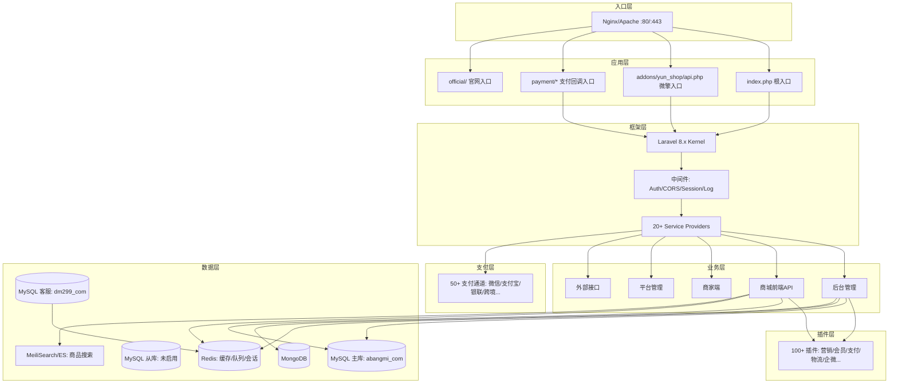
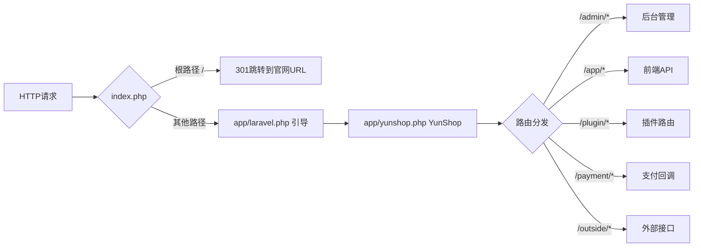

# 芸众商城 (abangmishop) — 部署与配置文档

> **版本**: 主版本 2.3.359 | 后台 2.1.874 | 前端 2.2.988 | 商家端 1.1.113  
> **最后更新**: 2026-05-23  
> **文档基于代码实际分析生成**

---

## 1. 代码仓库

| 项目 | 信息 |
|------|------|
| **项目名称** | abangmishop (芸众商城 SaaS 中台) |
| **本地路径** | `e:\project\abangmishop` |
| **Git 仓库** | 当前项目未检测到 `.git/config`，可能是从压缩包部署或 Git 信息已移除 |
| **框架** | Laravel 8.83.27 + 微擎 (WeEngine) |
| **PHP 版本要求** | ^7.4 \| ^8.0 |

---

## 2. 服务器配置

### 2.1 当前服务器环境

| 项目 | 值 |
|------|-----|
| **运行模式** | `platform`（独立平台模式，不依赖微擎框架） |
| **环境** | `production` |
| **Debug 模式** | `false` |
| **时区** | PRC (Asia/Shanghai) |
| **Web 入口路径** | `/admin/shop` |
| **根路径** | `''` (空，即项目根目录) |
| **扩展目录** | `addons` |

### 2.2 数据库配置

#### 主库 (MySQL)

| 配置项 | 值 |
|--------|-----|
| **主机** | `localhost` |
| **端口** | `3306` |
| **数据库名** | `abangmi_com` |
| **用户名** | `shanmu_db` |
| **密码** | `liusan123` |
| **表前缀** | `ims_` |

#### 备选主库 (阿里云 PolarDB，已注释)


#### 从库 (读写分离)

| 配置项 | 值 |
|--------|-----|
| **状态** | `false`（当前未启用读写分离） |
| **主机** | 未配置 |
| **用户名** | 未配置 |

#### 客服数据库 (独立库)

| 配置项 | 值 |
|--------|-----|
| **主机** | `localhost` |
| **端口** | `3306` |
| **数据库名** | `dm299_com` |
| **用户名** | `shanmu_db` |
| **密码** | `liusan123` |
| **表前缀** | `dm_` |

### 2.3 Redis 配置

| 配置项 | 值 |
|--------|-----|
| **主机** | `127.0.0.1` |
| **端口** | `6379` |
| **密码** | 无 |
| **默认数据库** | `0` |
| **缓存数据库** | `1` |
| **连接方式** | `predis` |
| **持久连接** | `0`（关闭） |

### 2.4 MongoDB 配置

| 配置项 | 值 |
|--------|-----|
| **主机** | `127.0.0.1` |
| **端口** | `27017` |
| **用户名** | 无 |
| **密码** | 无 |
| **数据库名** | 默认与 MySQL 主库同名 |

### 2.5 搜索引擎配置

| 配置项 | 值 |
|--------|-----|
| **默认驱动** | `meilisearch` |
| **MeiliSearch 地址** | `http://localhost:7700` |
| **搜索服务地址** | `http://127.0.0.1:8009` |
| **支持方案** | MeiliSearch / Elasticsearch |

---

## 3. 系统地址与账号

### 3.1 域名与 URL

| 用途 | 地址 |
|------|------|
| **Cookie 域名** | `.abangmi.cn` |
| **客服页面** | `https://help.abangmi.cn/buyer` |
| **客服 API** | `https://kefu.abangmi.cn/` |
| **搜索服务** | `http://127.0.0.1:8009` |
| **更新检查** | `https://yun.yunzmall.com/update` |
| **注册服务** | `https://yun.yunzmall.com/register` |
| **DIY 市场** | `https://yun.yunzmall.com` |
| **RPC 服务** | `http://market.cc/rpc` |

### 3.2 邮件配置 (SMTP)
| 配置项 | 值 |
|--------|-----|
| **驱动** | `smtp` |
| **SMTP 服务器** | `smtp.exmail.qq.com` |
| **端口** | `465` |
| **加密方式** | `ssl` |
| **发件邮箱** | `shenyang@yunzshop.com` |
| **发件人** | `shenyang` |
| **密码** | `CaF7uaySRjEcBusQ` |

### 3.3 第三方服务密钥

| 服务 | Key/ID | Secret/密码 |
|------|--------|-------------|
| **高德地图** | `bfef4fbd716119e9404e00dda6434f46` | `40c60189ca5f2e05a0b2c2a711261aca` (安全JS码) |
| **阿里云短信** | 从 `.env` 读取 (`ALISMS_KEY`) | 从 `.env` 读取 (`ALISMS_SECRETKEY`) |
| **微信** | `your-app-id` (模板) | `your-app-secret` (模板) |
| **微信支付商户** | `your-mch-id` (模板) | `key-for-signature` (模板) |
| **华为云 OBS** | 从 `.env` 读取 | 从 `.env` 读取 |
| **腾讯云 COS** | 从 `.env` 读取 | 从 `.env` 读取 |
| **腾讯云直播** | 从 `.env` 读取 | 从 `.env` 读取 |
| **腾讯云 TIIA** | 从 `.env` 读取 | 从 `.env` 读取 |
| **AWS S3** | 从 `.env` 读取 (`AWS_KEY`) | 从 `.env` 读取 (`AWS_SECRET`) |

> **注意**: 微信/支付宝等支付通道的商户号、密钥等核心配置存储在数据库 `ims_yz_setting` 表中，而非配置文件。

### 3.4 应用密钥

| 配置项 | 值 |
|--------|-----|
| **APP_KEY** | `base64:2q7s0Z714xS1L1WNN/8dsB69XDqOb4Qdptgh4X2ZtZU=` |
| **加密算法** | `AES-256-CBC` |

---

## 4. 系统架构

### 4.1 整体架构图



### 4.2 目录架构

```
abangmishop/
├── index.php              # 主入口: 301跳转官网或加载Laravel
├── admin.html             # 后台入口跳转页面
├── api.php                # 微擎API入口
├── shop.php               # 商城独立入口
├── module.php             # 模块管理入口
├── cron.php               # 定时任务入口
├── processor.php          # 消息处理器入口
├── officialwebsite.php    # 官网入口
├── daemon.sh              # 进程守护脚本 (Workerman)
│
├── app/                   # Laravel应用核心
│   ├── laravel.php        # Laravel引导文件
│   ├── yunshop.php        # 芸众核心: YunShop/YunApp/YunPlugin/YunNotice
│   ├── helpers.php        # 全局辅助函数 (141KB)
│   ├── Kernel.php         # HTTP内核
│   ├── backend/           # 后台管理
│   ├── frontend/          # 商城前端 (API)
│   │   └── modules/       # 前端业务模块 (30个: 购物车/订单/商品/会员...)
│   ├── common/            # 公共模块 (跨端复用)
│   │   ├── models/        # 公共数据模型 (146个)
│   │   ├── services/      # 公共服务 (92个)
│   │   ├── modules/       # 公共业务模块 (32个)
│   │   ├── events/        # 事件定义 (44个)
│   │   ├── listeners/     # 事件监听器 (20个)
│   │   ├── middleware/    # 中间件 (13个)
│   │   └── providers/     # 服务提供者 (14个)
│   ├── Jobs/              # 异步队列任务 (67个)
│   ├── platform/          # 平台管理
│   ├── framework/         # 框架扩展 (数据库/Redis/HTTP/日志)
│   └── exports/           # 数据导出
│
├── business/              # 商家端 (独立命名空间)
├── config/                # 配置文件 (35个)
├── database/              # 数据库
│   ├── config.php         # ★ 数据库连接配置 (微擎兼容)
│   ├── redis.php          # ★ Redis连接配置
│   ├── migrations/        # 迁移文件 (665个)
│   └── seeders/           # 种子数据 (29个)
├── payment/               # 支付回调处理 (50+通道)
├── plugins/               # 插件系统 (100+个)
├── routes/                # 路由定义 (8个文件)
├── addons/yun_shop/       # 微擎模块入口
│   ├── api.php            # 微擎API入口引导
│   ├── static/            # 模块静态资源
│   └── shopConfig.js      # ★ 高德地图Key配置
├── official/              # 官网模块
├── vendor/                # Composer依赖
├── storage/               # 存储 (日志/缓存/上传)
├── .env                   # 环境配置
└── composer.json          # PHP依赖
```

### 4.3 入口请求流程



### 4.4 多入口体系

| 入口文件 | URL路径 | 用途 |
|----------|---------|------|
| `index.php` | `/` | 主入口，根路径301跳转官网 |
| `api.php` | `/api.php` | 微擎兼容API |
| `shop.php` | `/shop.php` | 商城独立入口 |
| `admin.html` | `/admin.html` | 后台管理跳转页 |
| `module.php` | `/module.php` | 模块管理 |
| `site.php` | `/site.php` | 站点入口 |
| `processor.php` | `/processor.php` | 微信消息处理器 |
| `cron.php` | `/cron.php` | 定时任务触发 |
| `install.php` | `/install.php` | 模块安装 |
| `uninstall.php` | `/uninstall.php` | 模块卸载 |
| `officialwebsite.php` | `/officialwebsite.php` | 官网页面 |

---

## 5. 部署文档

### 5.1 环境要求

| 组件 | 最低版本 | 说明 |
|------|----------|------|
| **操作系统** | CentOS 7+ / Ubuntu 18.04+ / Windows Server | Linux 推荐 |
| **PHP** | 7.4+ | 需安装扩展: pdo, pdo_mysql, redis, mongodb, gd, curl, mbstring, xml, bcmath, fileinfo |
| **MySQL** | 5.7+ | InnoDB引擎, utf8mb4字符集 |
| **Redis** | 6.0+ | 队列/缓存/会话 |
| **MongoDB** | 4.0+ | 可选，部分功能需要 |
| **MeiliSearch** | 1.0+ | 可选，商品搜索 |
| **Nginx** | 1.18+ | 推荐使用 |
| **Composer** | 2.x | PHP依赖管理 |
| **Node.js** | 14+ | 前端资源编译 (可选) |

### 5.2 部署步骤

#### 步骤1: 基础环境准备

```bash
# CentOS 示例
yum install -y php74 php74-fpm php74-mysqlnd php74-redis php74-gd \
  php74-curl php74-mbstring php74-xml php74-bcmath php74-fileinfo

# 安装 Composer
curl -sS https://getcomposer.org/installer | php
mv composer.phar /usr/local/bin/composer

# 安装 Redis
yum install -y redis && systemctl enable redis && systemctl start redis
```

#### 步骤2: 部署代码

```bash
# 将项目代码放置到 Web 目录
cp -r abangmishop /var/www/html/abangmishop
cd /var/www/html/abangmishop

# 安装 PHP 依赖
composer install --no-dev --optimize-autoloader

# 安装前端依赖并编译 (可选)
npm install && npm run prod
```

#### 步骤3: 配置环境

```bash
# 复制环境配置 (如无 .env 文件)
cp .env.example .env

# 编辑 .env 文件
vi .env
```

**.env 最小配置**:

```env
APP_ENV=production
APP_KEY=base64:2q7s0Z714xS1L1WNN/8dsB69XDqOb4Qdptgh4X2ZtZU=
APP_DEBUG=false
APP_URL=https://your-domain.com

APP_Framework=platform
IS_WEB=/admin/shop
ROOT_PATH=''
EXTEND_DIR=''

DB_CONNECTION=mysql
DB_HOST=127.0.0.1
DB_PORT=3306
DB_DATABASE=abangmi_com
DB_USERNAME=shanmu_db
DB_PASSWORD=liusan123
DB_PREFIX=ims_

REDIS_HOST=127.0.0.1
REDIS_PASSWORD=null
REDIS_PORT=6379

QUEUE_DRIVER=redis
SCOUT_DRIVER=meilisearch
MEILISEARCH_HOST=http://127.0.0.1:7700
MEILISEARCH_KEY=

SEARCH_URL=http://127.0.0.1:8009
```

#### 步骤4: 数据库配置

```bash
# 数据库连接配置在 database/config.php
# 如果使用 .env 中的配置，需要确保 APP_Framework=platform
# 否则会从微擎 data/config.php 加载

# 创建数据库
mysql -u root -p -e "CREATE DATABASE IF NOT EXISTS abangmi_com DEFAULT CHARSET utf8mb4 COLLATE utf8mb4_unicode_ci;"

# 导入迁移 (生产环境慎用，可能覆盖已有数据)
php artisan migrate

# 设置目录权限
chmod -R 755 storage bootstrap/cache
chown -R www:www storage bootstrap/cache
```

#### 步骤5: Nginx 配置

```nginx
server {
    listen 80;
    server_name your-domain.com abangmi.cn *.abangmi.cn;
    root /var/www/html/abangmishop;
    index index.php index.html;

    # 主路由
    location / {
        try_files $uri $uri/ /index.php?$query_string;
    }

    # 微擎入口
    location /addons/ {
        try_files $uri $uri/ /addons/yun_shop/api.php?$query_string;
    }

    # 支付回调 (直接访问)
    location /payment/ {
        try_files $uri $uri/ /payment/index.php?$query_string;
    }

    # PHP 处理
    location ~ \.php$ {
        fastcgi_pass 127.0.0.1:9000;
        fastcgi_index index.php;
        fastcgi_param SCRIPT_FILENAME $document_root$fastcgi_script_name;
        include fastcgi_params;
    }

    # 静态资源缓存
    location ~* \.(js|css|png|jpg|jpeg|gif|ico|svg|woff|woff2|ttf|eot)$ {
        expires 30d;
        add_header Cache-Control "public, immutable";
    }

    # 禁止访问敏感文件
    location ~ /\. {
        deny all;
    }
    location ~ /(composer\.json|composer\.lock|\.env|package\.json) {
        deny all;
    }
}
```

#### 步骤6: 启动服务

```bash
# 清除缓存
php artisan optimize:clear
php artisan config:cache
php artisan route:cache
php artisan view:cache

# 启动队列 Worker (使用 Supervisor 守护)
php artisan queue:work redis --queue=default --tries=3 --timeout=600 --daemon &

# 启动 Workerman (MQTT长连接)
php artisan shop start

# 或使用守护脚本
bash daemon.sh /usr/bin/php
```

### 5.3 Supervisor 进程守护

```ini
# /etc/supervisord.d/yunshop.ini

[program:yunshop-queue]
process_name=%(program_name)s_%(process_num)02d
command=php /var/www/html/abangmishop/artisan queue:work redis --queue=default --tries=3 --timeout=600
directory=/var/www/html/abangmishop
autostart=true
autorestart=true
numprocs=4
redirect_stderr=true
stdout_logfile=/var/log/supervisor/yunshop-queue.log

[program:yunshop-workerman]
process_name=%(program_name)s
command=php /var/www/html/abangmishop/artisan shop start
directory=/var/www/html/abangmishop
autostart=true
autorestart=true
stdout_logfile=/var/log/supervisor/yunshop-workerman.log
```


### 5.5 支付回调白名单

以下支付回调 URL 需要在支付平台配置 **无需登录的 CSRF 白名单**：

```
# 微信支付
/payment/wechat/notifyUrl.php
/payment/wechat/refundNotifyUrl.php

# 支付宝
/payment/alipay/notifyUrl.php
/payment/alipay/refundNotifyUrl.php

# 聚合支付
/payment/convergepay/notifyUrl.php
/payment/convergepay/notifyUrlAlipay.php
/payment/convergepay/notifyUrlWechat.php
/payment/convergepay/notifyUrlUnionPay.php

# PayPal
/payment/paypal/payNotify.php

# ... 更多见 payment/ 目录下各通道 notifyUrl.php
```

---

## 6. 系统运维

### 6.1 常用运维命令

```bash
# ===== 应用维护 =====
php artisan down                    # 维护模式
php artisan up                      # 恢复

# ===== 缓存管理 =====
php artisan cache:clear             # 清除应用缓存
php artisan config:clear            # 清除配置缓存
php artisan route:clear             # 清除路由缓存
php artisan view:clear              # 清除视图缓存
php artisan optimize:clear          # 清除所有缓存

# ===== 队列管理 =====
php artisan queue:work redis --queue=default  # 启动Worker
php artisan queue:failed            # 查看失败任务
php artisan queue:retry all         # 重试所有失败
php artisan queue:flush             # 清空失败任务

# ===== 数据库 =====
php artisan migrate                 # 运行迁移
php artisan migrate:rollback        # 回滚迁移
php artisan migrate:status          # 迁移状态
php artisan db:seed                 # 数据填充

# ===== 搜索 =====
php artisan scout:import "App\Models\Goods"  # 导入商品索引

# ===== 进程管理 =====
php artisan shop start              # 启动Workerman
php artisan shop stop               # 停止Workerman
php artisan shop restart            # 重启Workerman
php artisan shop status             # 查看状态
```

### 6.2 日志位置

| 日志 | 路径 |
|------|------|
| **Laravel 日志** | `storage/logs/laravel-YYYY-MM-DD.log` (保留7天) |
| **微信日志** | `storage/easywechat/easywechat.log` |
| **队列日志** | Supervisor 配置的 stdout_logfile |
| **Nginx 日志** | `/var/log/nginx/access.log`, `/var/log/nginx/error.log` |

### 6.3 故障排查

| 问题 | 检查项 |
|------|--------|
| **页面500** | `storage/logs/laravel-*.log`, `.env` APP_DEBUG=true查看详情 |
| **搜索无结果** | MeiliSearch 服务状态: `curl http://127.0.0.1:7700/health` |
| **队列堆积** | Redis 内存: `redis-cli INFO memory`, Worker进程数 |
| **支付回调失败** | 回调URL可达性, CSRF白名单, 日志 |
| **下载限流异常** | Redis keys: `redis-cli KEYS "dl_limit_*"`, `redis-cli KEYS "dl_blacklist:*"` |
| **3D模型加载慢** | CDN配置, 文件大小, Redis缓存命中率 |
| **数据库连接失败** | `database/config.php` 和 `.env` 配置是否一致 |

### 6.4 Redis 关键 Key 命名规范

| 用途 | Key 模式 | TTL |
|------|----------|-----|
| 下载分钟限流 | `dl_limit:{file_type}:{goods_id}:{ip}:minute` | 60s |
| 下载小时配额 | `dl_limit:{file_type}:{goods_id}:{ip}:hour` | 3600s |
| IP黑名单 | `dl_blacklist:{ip}` | 可配置 |
| 商品详情缓存 | `goods:detail:{goods_id}` | 86400s |
| 会话 | `PHPSESSID:{session_id}` | 可配置 |

---

## 7. 配置优先级说明

配置加载的优先级从高到低：

1. **`.env` 环境变量** — 最高优先级
2. **`database/config.php`** — 数据库连接 (当 `APP_Framework != 'platform'` 时生效)
3. **`database/redis.php`** — Redis连接 (当 `APP_Framework == 'platform'` 时生效)
4. **`config/*.php`** — Laravel 配置文件 (使用 `env()` 辅助函数提供默认值)
5. **数据库 `ims_yz_setting` 表** — 微信/支付宝/支付通道等业务配置

> **重要**: 当 `APP_Framework=platform` 时，系统使用 `.env` 的数据库配置；否则从微擎 `data/config.php` 加载。当前环境为 `platform` 模式。

---

*文档2026-05-23*
