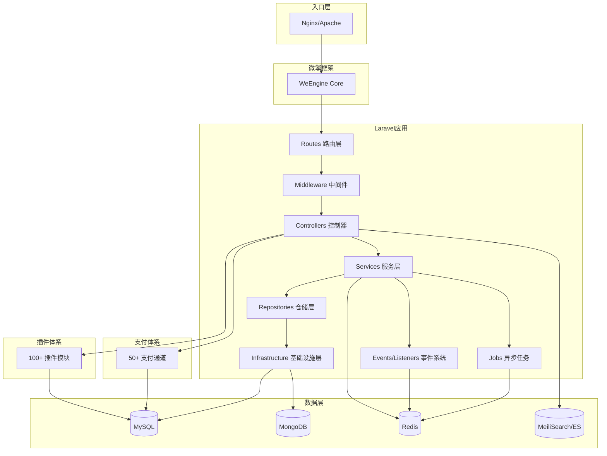
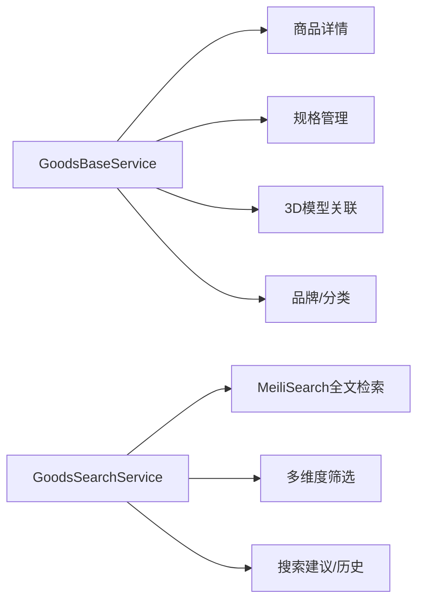
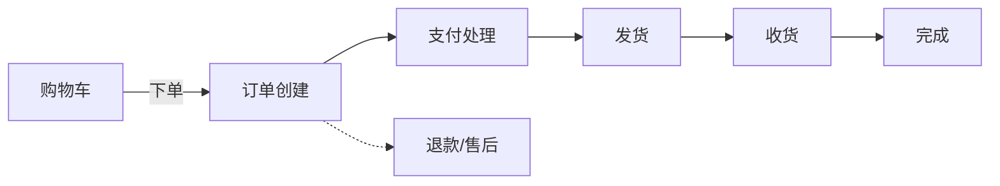
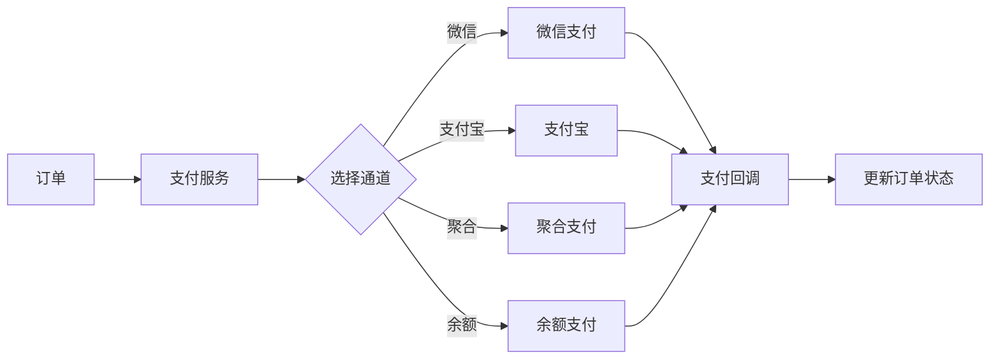

# 芸众商城 (Yunzong Mall) - Repository Wiki

## 1. 项目概述

**芸众商城 (abangmishop)** 是一个基于 Laravel 8 + 微擎 (WeEngine) 框架构建的大型 SaaS 电商中台系统，提供全链路电商解决方案。项目以 "插件化架构 + 多渠道支付 + 3D可视化" 为特色，支持 B2C、分销裂变、社区营销、直播带货等多种业务模式。

| 属性 | 值 |
|------|-----|
| **应用名称** | Yunshop |
| **微擎模块名** | yun_shop |
| **框架** | Laravel 8.83.27 |
| **PHP 版本** | ^7.4 \| ^8.0 |
| **时区** | PRC (Asia/Shanghai) |
| **默认语言** | zh_cn（中文简体） |
| **数据库** | MySQL (主) + MongoDB (辅助) |
| **缓存** | Redis (Predis/PhpRedis) |
| **搜索引擎** | MeiliSearch / Elasticsearch |
| **消息队列** | Redis Queue + Workerman MQTT |

---

## 2. 技术栈

### 2.1 后端技术栈

| 类别 | 技术 | 版本 | 用途 |
|------|------|------|------|
| **框架** | Laravel | 8.83.27 | Web 应用核心框架 |
| **数据库** | MySQL + MongoDB | - | 关系型 + 文档型混合存储 |
| **缓存** | Redis | - | 数据缓存、队列、限流、会话 |
| **搜索引擎** | MeiliSearch / Elasticsearch | - | 商品全文检索 |
| **消息队列** | Redis Queue | - | 异步任务调度 |
| **MQTT** | Workerman MQTT | 1.6 | 即时消息推送 |
| **HTTP客户端** | Guzzle | 6.5.8 | 外部 API 调用 |
| **Excel处理** | PhpSpreadsheet / Maatwebsite | 3.x | 数据导入导出 |
| **图片处理** | Intervention Image | 2.7.2 | 图片裁剪/水印 |
| **PDF生成** | - | - | 图纸、报价单生成 |
| **二维码** | BaconQrCode / SimpleQrcode | - | 二维码生成 |
| **验证码** | Gregwar/Captcha / Mews/Captcha | - | 图形验证码 |
| **微信开发** | EasyWeChat / Overtrue/Wechat | 4.x / 5.x | 微信公众号/小程序 |
| **支付宝** | Yansongda/Pay | 2.10.6 | 支付宝支付 |
| **PayPal** | PayPal REST API | - | 跨境支付 |
| **云存储** | 华为OBS / 腾讯COS | - | 文件存储/CDN |

### 2.2 前端技术栈

| 类别 | 技术 | 版本 | 用途 |
|------|------|------|------|
| **构建工具** | Laravel Mix (Webpack) | 6.0.49 | 前端资源编译打包 |
| **3D渲染** | Three.js | 0.171.0 | 3D 商品模型在线预览 |
| **动画库** | Tween.js | 18.6.4 | 3D 模型交互动画 |

### 2.3 微擎框架集成

项目基于 **微擎 (WeEngine)** 体系，遵循微擎模块开发规范。关键集成点：
- 数据库配置从微擎 `data/config.php` 动态加载
- 模块入口：`addons/yun_shop/` 目录
- 路由兼容：`api.php`、`shop.php`、`module.php` 等多入口

---

## 3. 系统架构



### 3.1 分层架构

```
┌──────────────────────────┐
│   Routes / Middleware     │  ← HTTP 请求入口与鉴权
├──────────────────────────┤
│   Controllers            │  ← API 控制器层 (Request/Response)
├──────────────────────────┤
│   Services               │  ← 业务逻辑层
├──────────────────────────┤
│   Repositories           │  ← 数据访问抽象接口
├──────────────────────────┤
│   Infrastructure          │  ← 具体数据源实现 (DB/API/Cache)
├──────────────────────────┤
│   Models / Entities      │  ← 数据模型定义
└──────────────────────────┘
```

### 3.2 Service Provider 体系

| Provider | 职责 |
|----------|------|
| `ShopProvider` | 商城管理核心 |
| `YunShopServiceProvider` | 芸众业务注册 |
| `PluginServiceProvider` | 插件加载与生命周期 |
| `PaymentServiceProvider` | 支付通道注册 |
| `ExportServiceProvider` | 数据导出服务 |
| `CronServiceProvider` | 计划任务管理 |
| `ProjectServiceProvider` | Project 模块注册 |
| `BusServiceProvider` | 命令总线(自定义) |
| `DatabaseServiceProvider` | 数据库(自定义扩展) |
| `QueueServiceProvider` | 队列(自定义扩展) |
| `RedisServiceProvider` | Redis(自定义扩展) |

---

## 4. 目录结构

```
abangmishop/
├── app/                          # Laravel 应用核心
│   ├── backend/                  # 后台管理模块
│   ├── common/                   # 公共模块（跨端复用）
│   │   ├── components/           # 通用组件
│   │   ├── cron/                 # 定时任务 (28个)
│   │   ├── events/               # 事件定义 (44个)
│   │   ├── exceptions/           # 异常处理
│   │   ├── facades/              # 门面 (Setting, Option...)
│   │   ├── helpers/              # 辅助函数
│   │   ├── listeners/            # 事件监听器 (20个)
│   │   ├── middleware/           # 中间件
│   │   ├── models/               # 公共数据模型 (146个)
│   │   ├── modules/              # 公共业务模块 (32个)
│   │   ├── observers/            # 模型观察者
│   │   ├── payment/              # 支付公共逻辑
│   │   ├── providers/            # 服务提供者 (14个)
│   │   ├── repositories/         # 公共仓储
│   │   ├── route/                # 公共路由
│   │   ├── services/             # 公共服务 (92个)
│   │   └── traits/               # Trait 复用
│   ├── console/                  # Artisan 命令
│   ├── exports/                  # 数据导出
│   ├── framework/                # 框架扩展层
│   ├── frontend/                 # 前端/API 模块
│   │   ├── controllers/          # 前端控制器
│   │   ├── models/               # 前端数据模型
│   │   ├── modules/              # 前端业务模块 (30个)
│   │   │   ├── cart/             # 购物车
│   │   │   ├── coupon/           # 优惠券
│   │   │   ├── deduction/        # 抵扣
│   │   │   ├── dispatch/         # 配送
│   │   │   ├── finance/          # 财务
│   │   │   ├── goods/            # 商品
│   │   │   ├── member/           # 会员
│   │   │   ├── order/            # 订单
│   │   │   ├── project/          # Project 3D模块 ⭐
│   │   │   ├── refund/           # 退款
│   │   │   └── withdraw/         # 提现
│   │   ├── repositories/         # 前端仓储
│   │   └── widgets/              # 前端小组件
│   ├── host/                     # 宿主模式入口
│   ├── http/                     # HTTP 核心
│   ├── Jobs/                     # 异步任务 (67个)
│   ├── Mail/                     # 邮件模板
│   ├── outside/                  # 外部接口
│   ├── payment/                  # 支付回调处理
│   ├── platform/                 # 平台管理
│   ├── process/                  # 业务流程
│   ├── worker/                   # Worker 进程
│   ├── helpers.php               # 全局辅助函数 (141KB)
│   ├── yunshop.php               # 芸众引导文件
│   └── Kernel.php                # HTTP 内核
├── business/                     # 商家端业务逻辑
├── config/                       # 配置文件 (35个)
├── database/                     # 数据库迁移与填充
│   ├── migrations/               # 迁移文件 (665个)
│   └── seeders/                  # 种子数据 (29个)
├── docs/                         # 项目文档
├── payment/                      # 支付通道实现 (50+)
├── plugins/                      # 插件系统 (100+)
├── resources/                    # 视图/语言/前端资源
├── routes/                       # 路由定义
│   ├── admin.php                 # 后台路由
│   ├── api.php                   # API 路由
│   ├── business.php              # 商家端路由
│   ├── outside.php               # 外部接口路由
│   ├── shop.php                  # 商城路由
│   └── web.php                   # Web 路由
├── static/                       # 静态资源
├── storage/                      # 存储目录
├── vendor/                       # Composer 依赖
├── addons/yun_shop/              # 微擎模块入口
│   ├── static/                   # 模块静态资源
│   ├── api.php                   # 微擎 API 入口
│   └── shopConfig.js             # 商城前端配置
├── composer.json                 # PHP 依赖定义
├── package.json                  # JS 依赖定义
├── artisan                       # Laravel CLI
└── .env                          # 环境配置
```

---

## 5. 核心功能模块

### 5.1 商品系统



**关键文件**：
| 文件 | 行数 | 职责 |
|------|------|------|
| `GoodsBaseService.php` | ~1820行 | 商品数据加载、3D模型、规格树构建 |
| `GoodsSearchService.php` | ~1142行 | 全文搜索、多维度筛选、条件联动 |
| `GoodsRepository.php` | ~1465行 | 商品数据访问、CAD解析、批量操作 |
| `GoodsController.php` | ~303行 | 商品相关 API 路由处理 |

### 5.2 3D可视化模块 (Project 模块)

| 功能 | 实现 | 说明 |
|------|------|------|
| 3D模型加载 | `getThreeModel()` | 支持多种 3D 模型格式在线展示 |
| 交互动画 | Tween.js | 模型旋转、缩放、视角切换动画 |
| CAD图纸解析 | `analysis()` / `analysisV2()` | DWG 文件上传后自动解析空间布局 |
| 下载限流 | `DownloadLimitService` | IP+商品+文件类型三级限流防护 |

**下载限流策略**：

| 文件类型 | 分钟限流 | 小时配额 | Key 维度 |
|----------|----------|----------|----------|
| 3D模型 (`3d`) | 10次/分钟 | 100次/小时 | IP + GoodsID + FileType |
| CAD文件 (`cad`) | 15次/分钟 | 150次/小时 | IP + GoodsID + FileType |
| 图册PDF (`atlas`) | 20次/分钟 | 300次/小时 | IP + GoodsID + FileType |
| 色卡 (`color_card`) | 20次/分钟 | 300次/小时 | IP + GoodsID + FileType |

### 5.3 订单系统



**核心模块**：
- `cart/` — 购物车管理 (多规格、多商家)
- `order/` — 订单生命周期 (24个子模块)
- `orderGoods/` — 订单商品明细
- `refund/` — 退款/售后流程
- `dispatch/` — 物流配送

### 5.4 会员系统

| 模块 | 功能 |
|------|------|
| `member/` | 会员基础信息、等级、积分 |
| `memberCart/` | 会员购物车 |
| `commission/` | 分销佣金计算 |
| `income/` | 收益管理 |
| `coin/` | 虚拟币/积分体系 |
| `withdraw/` | 提现管理 |

### 5.5 营销系统

| 插件/模块 | 功能 |
|-----------|------|
| `coupon/` | 优惠券管理 (创建/发放/核销) |
| `commission/` | 分销裂变 |
| `group-code/` | 拼团活动 |
| `lucky-draw/` | 抽奖活动 |
| `share-activity/` | 分享裂变活动 |
| `new-member-prize/` | 新人奖励 |
| `point-mall/` | 积分商城 |
| `sign/` | 签到打卡 |

---

## 6. 插件系统

项目采用 **插件化架构**，`plugins/` 目录下包含 **100+ 插件**，每个插件遵循统一的目录规范：

```
plugins/{plugin-name}/
├── src/           # 插件核心逻辑
├── views/         # 插件视图
├── assets/        # 插件静态资源
├── config/        # 插件配置
└── plugin.json    # 插件清单
```

### 6.1 主要插件分类

| 分类 | 插件 |
|------|------|
| **营销插件** | `commission`(分销), `coupon-qr`(优惠券), `group-code`(拼团), `lucky-draw`(抽奖), `share-activity`(分享), `random-discount`(随机折扣) |
| **会员插件** | `member-price`(会员价), `member-tags`(标签), `new-member-prize`(新人礼), `real-name-auth`(实名认证) |
| **商品插件** | `goods-assistant`(商品助手), `goods-ranking`(排行榜), `supplier`(供应商), `point-mall`(积分商城) |
| **内容插件** | `article`(文章), `broadcast`(直播), `picture-album`(相册), `material-center`(素材中心) |
| **企业微信** | `work-wechat`(企微), `work-wechat-platform`(企微平台), `work-wechat-tag`(标签), `wechat-chat-sidebar`(聊天侧边栏) |
| **运营工具** | `shop-statistics`(统计), `customer-manage`(客户管理), `customer-radar`(客户雷达), `sop-task`(SOP任务) |
| **交易支付** | `pay-manage`(支付管理), `service-fee`(服务费), `invoice`(发票), `electronics-bill`(电子面单) |
| **配送物流** | `city-delivery`(同城配送), `exhelper`(快递助手), `package-delivery`(包裹配送), `express-company`(快递公司) |
| **门店POS** | `shop-pos`(门店POS), `shop-assistant`(店长助手), `shop-clerk`(店员管理), `storeaggregate`(门店聚合) |
| **小程序/App** | `min-app`(小程序), `pc-terminal`(PC端), `appletslive`(小程序直播) |
| **第三方对接** | `meituan-group-buy`(美团), `tiktok-group-buy`(抖音), `jd-supply`(京东供应链), `leshua-pay`(乐刷支付) |

---

## 7. 支付系统

项目支持 **50+ 支付通道**，统一由 `PaymentServiceProvider` 注册管理，位于 `payment/` 目录下。

### 7.1 支付通道一览

| 分类 | 支付通道 |
|------|----------|
| **微信支付** | `wechat`, `wechatscan`, `wxIntegrationPay`, `wxIntegrationSharePay`, `thirdPartyWechat` |
| **支付宝** | `alipay`, `zfbIntegrationPay`, `zfbIntegrationSharePay`, `alipayPeriodDeduct` |
| **银联/云闪付** | `eup`, `yunpay`, `yoppay`, `yoppro`, `yopsystem`, `yopmerchant` |
| **聚合支付** | `convergepay`, `convergequickpay`, `convergeseparate`, `storeaggregate` |
| **跨境支付** | `paypal`, `usdtpay` |
| **余额支付** | `storebalance`, `membercard`, `silverPointPay`, `rechargeplatform` |
| **分期/信用** | `merchantLoanPay`, `huibeiPay`, `dragondeposit` |
| **三方通道** | `sandpay`(杉德), `lakala`(拉卡拉), `leshua`(乐刷), `huanxun`(环迅), `toutiaopay`(头条) |
| **其他** | `dianbangscan`, `jueqi`, `jinepay`, `xfpay`, `icbcPay`, `hkscan`, `pld`, `wft`, `authPay` |

### 7.2 支付系统流程



---

## 8. 异步任务队列

项目内置 **67 个 Job 类**，运行在 Redis Queue 上，通过 Workerman 实现常驻进程。

### 8.1 核心 Job 分类

| 类别 | Job 类 | 用途 |
|------|--------|------|
| **订单处理** | `OrderCreatedEventQueueJob` | 订单创建后事件分发 |
| | `OrderPaidEventQueueJob` | 支付完成事件处理 |
| | `OrderReceivedEventQueueJob` | 收货完成事件处理 |
| | `OrderSentEventQueueJob` | 发货事件处理 |
| | `OrderBonusJob` | 订单分红计算 |
| **会员关系** | `ChangeMemberRelationJob` | 会员关系变更 |
| | `ModifyRelationJob` | 关系修改 |
| | `ModifyRelationshipChainJob` | 关系链重建 (14.5KB) |
| | `MemberLowerOrderJob` | 下级订单统计 (11.6KB) |
| | `MemberLowerGroupOrderJob` | 下级团购订单 |
| **商品处理** | `GoodsImageJob` | 商品图片处理 |
| | `GoodsSetPriceJob` | 批量调价 |
| | `BatchImportGoodsJob` | 商品批量导入 |
| | `AssemblyGoodsJob` | 商品组装 |
| **3D/文件** | `UploadModelJob` | 3D模型上传处理 (13.4KB) |
| | `ProductCadJob` | CAD文件处理 (6.1KB) |
| | `GeneratePdfJob` | PDF生成 |
| | `HighPptJob` | PPT转换 |
| **消息通知** | `MessageJob` | 通用消息发送 |
| | `MiniMessageNoticeJob` | 小程序模板消息 (6KB) |
| | `MessageNoticeJob` | 系统通知 |
| | `MqttTopicMessageJob` | MQTT推送 |
| **搜索同步** | `UpdateMeiliSearch` | MeiliSearch索引更新 |

---

## 9. 数据库与缓存

### 9.1 数据库

| 连接名 | 类型 | 用途 |
|--------|------|------|
| `mysql` | MySQL (主库) | 核心业务数据 |
| `mysql_slave` | MySQL (从库) | 读分离 |
| `kefu` | MySQL | 客服系统独立库 |
| `mongodb` | MongoDB | 文档型数据存储 |

**配置来源**：优先读取 `.env`，其次从微擎 `data/config.php` 动态加载。

### 9.2 Redis 缓存

| 连接 | 用途 |
|------|------|
| `default` | 默认缓存、会话、队列 |
| `cache` | 独立缓存数据库 |

**关键缓存策略**：
- 商品详情：24小时缓存
- 3D模型数据：实时加载
- 下载限流：分钟/小时 TTL
- 会话数据：Session 驱动

### 9.3 搜索引擎

支持双引擎，通过 `.env` 配置切换：
- **MeiliSearch**：轻量级，内置中文分词
- **Elasticsearch**：重量级，通过 `laravel-scout-elasticsearch` 集成

---

## 10. 路由体系

### 10.1 路由文件

| 文件 | 大小 | 用途 |
|------|------|------|
| `routes/admin.php` | 13.3KB | 后台管理路由 |
| `routes/business.php` | 36.4KB | 商家端路由 |
| `routes/shop.php` | 0.2KB | 商城前端路由 |
| `routes/outside.php` | 1.9KB | 外部接口路由 |
| `routes/api.php` | 0.1KB | 公共 API 路由 |
| `routes/web.php` | 0.4KB | Web 通用路由 |
| `routes/console.php` | 0.6KB | Artisan 命令路由 |
| `routes/channels.php` | 0.5KB | 广播频道路由 |

### 10.2 微擎多入口

| 入口文件 | 功能 |
|----------|------|
| `index.php` | 主入口 |
| `api.php` | 微擎 API 入口 |
| `shop.php` | 商城独立入口 |
| `module.php` | 模块管理入口 |
| `site.php` | 站点入口 |
| `processor.php` | 消息处理器入口 |
| `cron.php` | 定时任务执行入口 |
| `install.php` / `uninstall.php` | 模块安装/卸载 |

---

## 11. 开发指南

### 11.1 环境要求

| 组件 | 最低版本 |
|------|----------|
| PHP | 7.4+ |
| MySQL | 5.7+ |
| Redis | 6.0+ |
| MongoDB | 4.0+ (可选) |
| Composer | 2.x |
| Node.js | 14+ (前端构建) |
| MeiliSearch | 1.0+ (可选) |

### 11.2 快速开始

```bash
# 1. 安装依赖
composer install
npm install

# 2. 配置环境
cp .env.example .env
# 编辑 .env 配置数据库、Redis 等

# 3. 生成应用密钥
php artisan key:generate

# 4. 运行数据库迁移
php artisan migrate

# 5. 启动队列 Worker
php artisan queue:work redis --queue=default

# 6. 编译前端资源
npm run dev  # 开发环境
npm run prod # 生产环境
```

### 11.3 代码规范

- **PSR-12** 编码标准
- **驼峰式**命名：类名大驼峰，方法/变量小驼峰
- **蛇形命名**：配置文件、数据库字段
- **分层原则**：Controller → Service → Repository → Infrastructure
- **事件驱动**：核心业务变更必须触发事件，通过 Listener 解耦
- **插件开发**：遵循 `plugins/` 统一目录规范

### 11.4 目录约定

| 目录 | 职责 |
|------|------|
| `app/common/` | 跨端复用逻辑（后台+前端+商家端共享） |
| `app/frontend/` | 商城前端 API 专属逻辑 |
| `app/backend/` | 后台管理专属逻辑 |
| `app/platform/` | 平台级管理逻辑 |
| `business/` | 商家端独立业务逻辑 |

### 11.5 常用命令

```bash
# 清理缓存
php artisan cache:clear
php artisan config:clear
php artisan route:clear
php artisan view:clear

# 队列管理
bash  daemon.sh

# 搜索引擎
php artisan meilisearch:reindex # 重建 MeiliSearch 索引 (如有)

# 定时任务
php artisan cron:run            # 执行计划任务

# 数据库
php artisan migrate:status      # 查看迁移状态
php artisan db:seed             # 运行数据填充
```

---

## 12. 部署与运维

### 12.1 生产环境配置

```env
APP_ENV=production
APP_DEBUG=false
APP_URL=https://your-domain.com

# 数据库
DB_CONNECTION=mysql
DB_HOST=127.0.0.1
DB_PORT=3306
DB_DATABASE=your_db
DB_USERNAME=your_user
DB_PASSWORD=your_password
DB_PREFIX=ims_

# Redis
REDIS_HOST=127.0.0.1
REDIS_PASSWORD=null
REDIS_PORT=6379

# 队列
QUEUE_DRIVER=redis

# 搜索引擎
SCOUT_DRIVER=meilisearch
MEILISEARCH_HOST=http://127.0.0.1:7700
MEILISEARCH_KEY=your_key

# 搜索服务
SEARCH_URL=http://127.0.0.1:8009
```

### 12.2 进程管理

| 进程 | 说明 | 启动方式 |
|------|------|----------|
| **Queue Worker** | 异步队列消费 | `php artisan queue:work redis --daemon` (用 Supervisor 守护) |
| **Workerman** | MQTT 长连接服务 | `php artisan workerman:start` |

### 12.3 Supervisor 配置示例

```ini
[program:yunshop-queue]
process_name=%(program_name)s_%(process_num)02d
command=php /path/to/abangmishop/artisan queue:work redis --queue=default --tries=3 --timeout=600
autostart=true
autorestart=true
numprocs=4
redirect_stderr=true
stdout_logfile=/path/to/logs/queue.log
```

### 12.4 常见问题

| 问题 | 排查方向 |
|------|----------|
| 搜索无结果 | 检查 MeiliSearch/ES 服务状态，执行 reindex 重建索引 |
| 3D模型加载慢 | 检查 CDN 配置，确认 OBS/COS 存储桶状态 |
| 下载限流异常 | 清理 Redis keys `dl_limit_*`, `dl_blacklist:*` |
| 队列堆积 | 检查 Redis 内存，增加 Worker 进程数 |
| 支付回调失败 | 检查回调 URL 可达性，查看 `storage/logs/` |
| 数据库连接失败 | 确认微擎 `data/config.php` 配置同步 |

---

## 13. 第三方服务依赖

| 服务 | 配置位置 | 用途 |
|------|----------|------|
| **华为云 OBS** | `config/filesystems.php` | 文件存储/CDN |
| **腾讯云 COS** | `config/filesystems.php` | 文件存储/CDN |
| **腾讯云直播** | `config/` | 直播服务 |
| **腾讯云 TIIA** | `config/` | 图像识别 |
| **阿里云短信** | `config/alisms.php` | 短信发送 |
| **快递鸟** | `config/app.php` → `express.KDN` | 物流查询 |
| **微信支付** | `config/wechat.php` | 微信支付配置 |
| **MeiliSearch** | `.env` | 商品搜索 |

---

## 14. 关键配置文件索引

| 文件 | 内容 |
|------|------|
| `config/app.php` | 应用名、时区、语言、Provider、Alias、支付类型、客服URL等 |
| `config/database.php` | MySQL主从、MongoDB、Redis连接配置 (动态加载) |
| `config/queue.php` | Redis Queue 配置 |
| `config/wechat.php` | 微信公众号/小程序配置 |
| `config/alisms.php` | 阿里云短信配置 |
| `config/filesystems.php` | OBS/COS 云存储配置 |
| `config/excel.php` | Excel 导入导出配置 |
| `config/ide-helper.php` | IDE 辅助工具配置 |
| `config/version.php` | 版本管理 |
| `config/business_version.php` | 商家端版本 |
| `config/backend_version.php` | 后台版本 |
| `config/front-version.php` | 前端版本 |
| `config/income.php` | 收益/分润配置 |
| `config/upload.php` | 上传配置 |
| `config/captcha.php` | 验证码配置 |
| `config/scout.php` | 搜索引擎配置 |
| `config/rpc.php` | RPC 远程调用配置 |


前端代码打包指令
cd /www/wwwroot/linshi_tayeedu_com/plugins/shop_server/
rm -rf plugins/shop_server/*
cp -r .nuxt/dist/client/. plugins/shop_server/
sudo -u www env PATH="/home/www/.nvm/versions/node/v24.11.0/bin:$PATH" pm2 restart shop

搜图服务启动
cd /www/wwwroot/imgsearch
docker-compose -f /www/wwwroot/imgsearch/docker-compose.yml  up -d

nohup python manage.py runserver 0.0.0.0:8009 &

meilisearch 启动服务
docker run -d \
  --name meilisearch \
  --restart unless-stopped \
  -p 7700:7700 \
  -v /opt/meilisearch_data:/meili_data \
  -e MEILI_HTTP_ADDR=0.0.0.0:7700 \
  -e MEILI_SERVER_PROVIDER=docker \
  -w /meili_data \
  getmeili/meilisearch:latest
---

客服启动服务

#!/bin/bash

PORT=5678
PHP_PATH="/usr/bin/php"
SCRIPT_PATH="/www/wwwroot/kefubackend/app/im/init.php"
LOG_FILE="/www/wwwroot/kefubackend/port_check.log"
ERROR_LOG="/www/wwwroot/kefubackend/service_error.log"  # 专门记录服务错误

current_time=$(date "+%Y-%m-%d %H:%M:%S")

check_port() {
    netstat -tlnp 2>/dev/null | grep ":$PORT " > /dev/null
    return $?
}

log_message() {
    echo "[$current_time] $1" >> "$LOG_FILE"
}

# 启动服务并记录错误
start_service() {
    log_message "正在启动服务..."
    
    # 方法1：将错误信息追加到 ERROR_LOG
    $PHP_PATH $SCRIPT_PATH start >> "$ERROR_LOG" 2>&1 &
    
    # 方法2：如果想把错误也记录到主日志
    # $PHP_PATH $SCRIPT_PATH start >> "$LOG_FILE" 2>&1 &
    
    return $?
}

# 主逻辑
if ! check_port; then
    log_message "端口 $PORT 未监听，尝试启动..."
    start_service
    sleep 3
    
    if check_port; then
        log_message "启动成功"
    else
        log_message "启动失败，请查看错误日志: $ERROR_LOG"
    fi
else
    log_message "端口 $PORT 正常运行"
fi


/etc/supervisord.d 里面涵盖 supervisord 启动配置

*文档2026年5月23日
